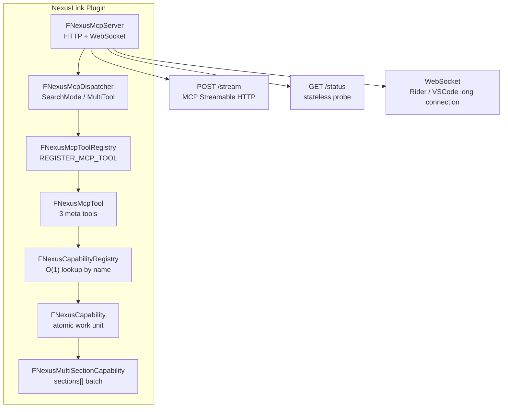

**Language / Language**: [简体中文](README.md) · **English**

# NexusLink — UE MCP Plugin

Repository: [bytepine/NexusLink](https://github.com/bytepine/NexusLink)

An MCP integration plugin for Unreal Engine that exposes UE project context to AI tools via the MCP protocol.

> Supports UE 4.26 and all later versions (including UE5)

## Architecture Overview



### Exposure Modes (ToolsListMode)

| Mode | tools/list returns | initialize.instructions | Use case |
|---|---|---|---|
| **SearchMode** (default) | 3 meta tools | `InitializeInstructions.SearchMode.md` (full routing table) | AI discovers capabilities on demand via `search_capabilities` |
| **MultiTool** | All enabled Capabilities (each as a separate Tool) + `submit_feedback` | `InitializeInstructions.MultiTool.md` (concise constraints) | Scenarios that need tools/list to enumerate all capabilities at once |

Mode switch path: Editor → Editor Preferences → Plugins → NexusLink → **Tools List Mode**. When Capabilities change, `notifications/tools/list_changed` is broadcast automatically.

## Installation & Enablement

Download `nexus-mcp-unreal-<version>.zip` from [NexusLink Releases](https://github.com/bytepine/NexusLink/releases), or clone this repository into your project's `Plugins/Developer/NexusLink`.

1. Place the plugin in your project's `Plugins/Developer/NexusLink`, then enable it under **Edit → Plugins → Developer → NexusLink**
2. After restarting the editor, open **Edit → Editor Preferences → Plugins → NexusLink**
3. Check **Enable MCP Server** (**off by default**) — once checked, HTTP (`POST /stream`) and WebSocket start immediately and the instance is registered for Rider/VSCode discovery; unchecking stops them immediately, **no editor restart required**

When unchecked: the toolbar shows no port, IDE proxies cannot discover the instance, and AI direct connections to `http://127.0.0.1:45000/stream` get no response. See the full user guide at [docs/usage-guide.md](docs/usage-guide.md) §2.

### Development Paths

**Path A — Pure Tool** (lightweight tools without sections; override `ExecuteImpl` directly)
1. Create `Private/Tools/<module>/NexusMcpToolXxx.h/.cpp`, inheriting `FNexusMcpTool`
2. Implement `GetName()` / `GetDescription()` / `ExecuteImpl()`
3. At the end of `.cpp`: `REGISTER_MCP_TOOL(FNexusMcpToolXxx)`

**Path B — Capability** (main path; business logic encapsulated in Capability, callable independently)
1. Create `Private/Capabilities/<category>/NexusXxxCapability.h/.cpp`, inheriting `FNexusCapability` (or `FNexusMultiSectionCapability` for multi-section)
2. Implement `BuildDefinition()` / `Execute()`; at the end of `.cpp`: `REGISTER_MCP_CAPABILITY(FNexusXxxCapability)`
3. Follow [Resources/CapabilitySpec.md](Resources/CapabilitySpec.md) (naming / four-part description / self-check checklist)
4. Capabilities are invoked directly via the `call_capability` meta tool, or exposed as standalone MCP Tools in MultiTool mode

---

## Feature List

### Meta Tools

- [x] `search_capabilities` — Discover Capabilities by intent. On failure, check `errorKind` (`not_found`/`disabled`/`disabled_only`); exact lookup via `capabilityName` or 1–2 word `query`; nested `parameters[]` (e.g. `widgets[].action` enum)
- [x] `call_capability` — Execute a Capability; on failure, check `errorKind` (`disabled` — do not retry). Legacy names (e.g. `create_blackboard`) auto-map to canonical names. **Single** / **batch** `calls[]`
- [x] `submit_feedback` — Report tool/Capability friction to improve discovery and schemas. Trigger when: ≥2 retries with no progress / no suitable cap found / schema fields require guessing / forced into ≥3 serial calls

### Editor Tools

- [x] `get_editor_info` — Get engine version, project name, platform, build configuration
- [x] `get_editor_context` — Read-only editor context (`sections`: `selection_actors` / `selection_assets` / `content_browser_path`; editor World ≠ PIE)
- [x] `search_console_variables` — Search console variable names by substring (read-only, includes current values)
- [x] `get_output_log` — Query UE output log buffer (category/verbosity/text filter + offset/limit pagination, most recent 2000 entries)
- [x] `set_log_capture_filter` — Dynamically set log capture whitelist (empty array = capture all; list = capture specified categories only)
- [x] `save_asset` — Persist assets to disk (`assetPaths` batch); uses `SaveDirtyPackage`; returns `deferred=true` during Live Coding
- [x] `delete_asset` — Delete a single asset package
- [x] `rename_asset` — Rename/move asset (engine auto-redirects references)
- [x] `duplicate_asset` — Copy asset to new path (any type; source unchanged)
- [x] `export_asset` — Export asset to disk file (Fbx/Stl etc., type-dependent)
- [x] `reimport_asset` — Reimport asset from source file
- [x] `control_pie` — Control PIE (start / stop / status)
- [x] `exec_command` — Execute UE console command and capture output
- [x] `get_asset_refs` — Query asset dependencies or referencers; supports recursion/filter/pagination
- [x] `get_gameplay_tags` — Query Gameplay Tags hierarchy tree (section=hierarchy), runtime Actor properties (section=actor), asset properties (section=asset), or assets referencing a tag (section=referencers, requires `tag`)
- [x] `capture_viewport` — Capture editor window (`editor` / `editor_desktop` full window), panel region, or PIE viewport (PNG/JPG; supports crop by Actor bounds, crop by UMG Widget region, multi-angle shots); screenshots saved to `Saved/NexusCaptures/`, auto-retains latest 20

### General Asset Tools

- [x] `search_asset` — Search project assets (assetType / pathFilter / nameFilter / query, paginated)
- [x] `get_asset_refs` — Query asset dependencies/referencers (see Editor Tools section)
- [x] `get_asset_lua_binding` — Query Blueprint UnLua binding (returns bound/moduleName/filePath; if `bound=false`, stop — do not guess paths)
- [x] `rename_asset` / `duplicate_asset` / `delete_asset` / `compile_blueprint` (`save_asset` see Editor Tools section)
- [x] `get_asset_texture` — Read Texture2D (dimensions, compression, sRGB, LOD)
- [x] `get_asset_static_mesh` — Read StaticMesh (LOD, material slots, collision summary)
- [x] `get_asset_anim_sequence` — Read AnimSequence (duration, frame rate, frame count, skeleton reference, notifies list)
- [x] `get_asset_skeletal_mesh` — Read SkeletalMesh (LOD, material slots, skeleton, PhysicsAsset)
- [x] `get_asset_skeleton` — Read Skeleton (paginated bone tree, Socket summary)
- [x] `get_asset_sound_wave` — Read SoundWave (duration, sample rate, channels)
- [x] `get_asset_sound_cue` — Read SoundCue (duration, SoundNode summary)
- [x] `get_asset_niagara_system` — Read NiagaraSystem (emitter list; UE5+ user parameter summary; requires `WITH_NIAGARA=1`)
- [x] `get_asset_level` — Read-only level inspection (UWorld package): `sections` `actors` (paginated + filtered) / `settings` (WorldSettings summary); `editor_only`
- [x] `manage_asset_texture` — Edit Texture2D properties (compression, sRGB, LODGroup, etc.)
- [x] `manage_asset_static_mesh` — Edit StaticMesh material slots and properties
- [x] `manage_asset_skeletal_mesh` — Edit SkeletalMesh material slots and properties
- [x] `manage_asset_skeleton` — Manage Skeleton Sockets (add/remove/edit)
- [x] `manage_asset_anim_sequence` — Edit AnimSequence (`add_notify` / `remove_notify` / `set_frame_rate` / `set_root_motion`)
- [x] `manage_asset_sound_wave` — Edit SoundWave properties (`action=set_property`)
- [x] `manage_asset_sound_cue` — Edit SoundCue (`set_property` / `add_node` / `remove_node` / `connect_nodes`)
- [x] `manage_asset_niagara_system` — Edit Niagara system (`set_property` / `set_user_parameter`; `WITH_NIAGARA=1`)
- [x] `manage_asset_level` — Edit level (`set_property` for WorldSettings; `spawn_actor` / `remove_actor` / `set_actor_property` for on-disk Actors; `editor_only`)

### Blueprint Tools

- [x] `create_asset_blueprint` — Create new Blueprint asset (optional parent class)
- [x] `get_asset_blueprint` — Read Blueprint details (sections: variables / functions / components / defaults / graphOverview / graphs / all); auto-detects UnLua binding, returns `luaModule` + `luaFilePath`
- [x] `manage_asset_blueprint` — Full Blueprint batch editing: variable CRUD (add/remove_variable), graph node ops (add/remove/set_node), connection ops (connect/disconnect), SCS components (add/remove_component, Actor BP only), CDO defaults (set_defaults)

### Animation Asset Tools

- [x] `create_asset_anim_blueprint` — Create AnimBlueprint asset (link to specified Skeleton, auto-compile)
- [x] `get_asset_anim_blueprint` — Read ABP structure (sections: variables / statemachines / defaults / graphOverview)
- [x] `manage_asset_anim_blueprint` — Manage state machines (add/remove state_machine / state / transition)
- [x] `create_asset_anim_montage` — Create AnimMontage asset (link to specified Skeleton)
- [x] `get_asset_anim_montage` — Read AnimMontage (Slot/Segment list, Section list)
- [x] `manage_asset_anim_montage` — Manage AnimMontage Segments (add/remove_segment) and Sections (add/remove_section)

### Material Tools

- [x] `create_asset_material` — Create Material or MaterialInstance (optional materialDomain / parentMaterial)
- [x] `get_asset_material` — Read material parameters and node graph (sections: parameters / graph / all)
- [x] `manage_asset_material` — Material batch editing entry (actions: set_param / add_node / remove_node / set_node / recompile; Texture nodes support defaultValue bound to asset path with derived SamplerType)

### Struct Tools

- [x] `create_asset_struct` — Create new UserDefinedStruct asset
- [x] `get_asset_struct` — Read Struct field list (name/type/defaultValue)
- [x] `manage_asset_struct_field` — Batch Struct field management (add/remove/set; supports rename/type change/default value change)

### Data Asset Tools (DataAsset / DataTable)

- [x] `create_asset_data_asset` — Create new DataAsset (requires parent class)
- [x] `create_asset_data_table` — Create new DataTable (requires row struct class name)
- [x] `get_asset_data_asset` — Read DataAsset properties
- [x] `get_asset_data_table` — Read DataTable rows (supports rowNames filter, pagination)
- [x] `manage_asset_data_asset` — Batch modify DataAsset fields (`action`: `set` / `reset`)
- [x] `manage_asset_data_table` — Batch DataTable row add/remove/edit (action: add / remove / set)

### Widget Blueprint Tools

- [x] `create_asset_user_widget` — Create new WidgetBlueprint asset (optional parent class)
- [x] `get_asset_user_widget` — Read WidgetBlueprint widget tree (`widgets` includes `layout`) + UMG animation list (`sections=widgets|animations`)
- [x] `manage_asset_user_widget` — Batch widget tree management (`add` / `remove` / `set_slot` / `set_property`; design-time operations)

### Lua Runtime Tools (requires UnLua plugin)

- [x] `eval_runtime_lua` — Execute Lua code snippet (requires PIE/Game + UnLua)
- [x] `dofile_runtime_lua` — Execute Lua file (requires PIE/Game + UnLua)
- [x] `set_runtime_lua` — Set Lua global variable
- [x] `gc_runtime_lua` — Run Lua garbage collection
- [x] `hotreload_runtime_lua` — Hot-reload Lua module
- [x] `get_runtime_lua_env` — Read Lua global environment table overview
- [x] `get_runtime_lua_value` — Read Lua variable value by path
- [x] `get_runtime_lua_loaded` — List loaded Lua modules
- [x] `get_runtime_lua_stack` — Read Lua call stack
- [x] `get_runtime_lua_metatable` — Inspect Lua object metatable
- [x] `get_runtime_lua_object` — Read runtime Actor Lua instance data
- [x] `get_runtime_lua_memory` — Lua memory statistics
- [x] `get_asset_lua_binding` — Query Blueprint UnLua binding (see General Asset Tools)

### Runtime Tools — requires PIE/Game

- [x] `list_runtime_actors` — List Actors in current World (classFilter / nameFilter / tagFilter + pagination)
- [x] `spawn_runtime_actor` — Batch spawn Actors (`spawns:[{blueprintPath?|className?,location?,rotation?}]`)
- [x] `destroy_runtime_actor` — Destroy specified Actor
- [x] `get_runtime_actor_property` — Read Actor properties (sections: components / attach_hierarchy / all; or diagnose preset; supports dot-path + container index; FUNC invocation)
- [x] `set_runtime_actor_property` — Batch write Actor properties (immediate effect)
- [x] `diff_runtime_actors` — Compare Actor property differences (pairwise or batch baseline mode)
- [x] `get_runtime_actor_animation` — Query Actor AnimInstance runtime state (sections: state / slots / variables)
- [x] `interact_runtime_actor_animation` — PIE montage play/stop (`action=play_montage|stop_montage|stop_all`) and AnimInstance variable write (`set_anim_variable`)
- [x] `get_runtime_actor_behavior_tree` — Read Actor AI runtime behavior tree execution state (section=runtime)
- [x] `interact_runtime_actor_behavior_tree` — Runtime blackboard key set, restart/stop behavior tree
- [x] `list_runtime_widgets` — List all active runtime UserWidgets
- [x] `spawn_runtime_widget` — Create UserWidget in PIE/Game and AddToViewport
- [x] `destroy_runtime_widget` — Remove from viewport and destroy runtime UMG panel
- [x] `interact_runtime_widget` — Operate runtime widgets (click / check / toggle / set / read; supports Button/CheckBox/Slider/TextBlock/EditableText/ProgressBar)
- [x] `get_runtime_widget_property` — Read runtime Widget properties; includes `layout` when no `propertyPath`
- [x] `set_runtime_widget_property` — Write runtime Widget properties
- [x] `get_runtime_slate_widget` — Get Slate widget info via Widget Reflector hex address (includes `layout`: anchors, AutoWrapText, etc.)

### AI Tools (Behavior Tree / Blackboard)

- [x] `create_asset_behavior_tree` — Create BehaviorTree asset (optionally create linked BlackboardData)
- [x] `create_asset_blackboard` — Create standalone empty BlackboardData asset
- [x] `get_asset_behavior_tree` — Read behavior tree node structure, path index, and decorator/service properties
- [x] `get_asset_blackboard` — Read Blackboard Keys
- [x] `manage_asset_behavior_tree` — Manage behavior tree node tree (`set_root` / `add_node` / `remove_node` / `move_node` / decorators & services / `set_property`; `add_node` supports `childIndex`)
- [x] `manage_asset_blackboard` — Batch add/remove/rename Blackboard Keys (supports bool/float/int/enum/string/name/vector/rotator/object/class)
- [x] `get_runtime_actor_behavior_tree` — Runtime AI execution state (see Runtime section)

### GAS Tools (Gameplay Ability System, registered when `WITH_GAS=1`)

> Requires `GameplayAbilities` plugin enabled in project `.uproject`. Graph node editing still uses `manage_asset_blueprint`.

**Gameplay Ability**

- [x] `create_asset_gameplay_ability` — Create GameplayAbility Blueprint (optional parent class)
- [x] `get_asset_gameplay_ability` — Read GA CDO (sections: metadata / tags / costs / graphOverview)
- [x] `manage_asset_gameplay_ability` — Modify GA CDO: `set_tags` (tag container + mode) / `set_policy` (instancing/network policy) / `set_cost_cooldown` (Cost/Cooldown GE binding)

**Gameplay Effect**

- [x] `create_asset_gameplay_effect` — Create GameplayEffect Blueprint
- [x] `get_asset_gameplay_effect` — Read GE CDO (sections: policy / modifiers / tags / cues)
- [x] `manage_asset_gameplay_effect` — Batch modify GE: `set_policy` (Duration/Period) / `set_tags` / `add_modifier` / `remove_modifier` / `set_modifier`

**AttributeSet**

- [x] `create_asset_attribute_set` — Create AttributeSet Blueprint
- [x] `get_asset_attribute_set` — Read all `FGameplayAttributeData` properties in AttributeSet CDO (name / baseValue / currentValue)
- [x] `manage_asset_attribute_set` — Batch `set`/`reset` AttributeSet CDO property defaults

**Runtime**

- [x] `get_runtime_actor_ability_system` — PIE runtime read of Actor ASC snapshot (sections: abilities / effects / attributes; read-only)
- [x] `interact_runtime_actor_ability_system` — PIE activate/cancel Ability, apply/remove GE, modify Attribute base values

---

## Server Framework Features

- [x] MCP Streamable HTTP (`POST /stream`), per-session isolation (`Mcp-Session-Id`), multi-client concurrency safe
- [x] `GET /status` — Stateless probe endpoint (project name, engine version, WS port, `netRole`)
- [x] WebSocket server (default from 55000), for Rider / VSCode proxy long connections; `nexus/instructions` returns `InitializeInstructions.*.md` per ToolsListMode; `nexus/proxy_config` returns `ProxyConfig.json` (connection tool description, initialize prefix, error messages — fetched dynamically by proxies)
- [x] **SearchMode** (default): tools/list exposes only 3 meta tools; AI discovers capabilities on demand via `search_capabilities`
- [x] **MultiTool**: tools/list exposes all enabled Capabilities (each as a separate MCP Tool) + `submit_feedback`; no `search_capabilities` / `call_capability`
- [x] Broadcast `notifications/tools/list_changed` on Capability change or mode switch
- [x] **Enable MCP Server** master switch (off by default): Editor Preferences → Plugins → NexusLink → Server; checking starts HTTP/WebSocket immediately and registers instance
- [x] Auto port allocation with conflict fallback; instance registration for zero-scan discovery (`{PID}.json` written to temp directory)
- [x] **Per-Capability enable/disable** (`IsCapabilityEnabled`): Editor Preferences → Plugins → NexusLink → Capabilities; category-level / per-item toggles
- [x] **Response default-value compaction for all tools** (`FNexusResponseCompactorUtils`): recursively scans object array fields, extracts dominant values as `<field>_defaults` to reduce response size; can be globally disabled via settings panel **Response Default Compaction**

---

## Related Documentation

- [docs/tool-reference.md](docs/tool-reference.md) — Full Capability parameter reference (script-generated; update with `py scripts/build_tool_reference.py`)
- [Resources/CapabilitySpec.md](Resources/CapabilitySpec.md) — Capability metadata spec (naming / four-part description / self-check checklist)
- [Resources/InitializeInstructions.SearchMode.md](Resources/InitializeInstructions.SearchMode.md) — SearchMode workflow for AI handshake (**First Action** / Tool Model / Intent→Capability routing / Hard Rules)
- [Resources/InitializeInstructions.MultiTool.md](Resources/InitializeInstructions.MultiTool.md) — MultiTool mode concise constraints
- [Resources/AIRules.mdc](Resources/AIRules.mdc) — IDE-side AI workflow Rule template (copy to game project `.cursor/rules/`; see [usage-guide §2.8](docs/usage-guide.md))
- [docs/testing.md](docs/testing.md) — pytest E2E regression test suite
- [CHANGELOG.md](CHANGELOG.md) — Version changelog

## Testing

Two-layer automation framework:

- **L1 C++ Automation** (`Source/NexusLinkTests/`): pure utility functions + plugin load + Capability registry smoke + full `FNexusResponseCompactorUtils` assertions. Trigger manually via UEEditor-Cmd:

  ```bash
  UEEditor-Cmd YourProject.uproject -ExecCmds="Automation RunTests NexusLink.; Quit" -unattended -nullrhi -NoSound -NoSplash
  ```

- **L2 pytest E2E** (maintain in your game project's `Tests/` directory): end-to-end regression of all Capabilities via `call_capability` (invoked under SearchMode; does not depend on MultiTool):

  ```powershell
  pip install -r Tests/requirements.txt
  python Script/run_e2e.py --ue-url http://127.0.0.1:45000/stream
  ```

  Report output to `Saved/Logs/TestReport.xml`. Details in [docs/testing.md](docs/testing.md).

**When adding a Capability**: add at least one happy-path test in the corresponding phase file under your game project's `Tests/test_*.py`, using `client.call_capability("cap_name", {...})`.

## Local Packaging

```bash
py scripts/build_unreal.py --version <version> --output release/
```

Output: `release/nexus-mcp-unreal-<version>.zip` — extract to UE project `Plugins/Developer/`.

## License

[MIT](LICENSE) © byteyang

> When adding or modifying Capabilities, sync this feature list and run `py scripts/build_tool_reference.py` to regenerate `docs/tool-reference.md`.
