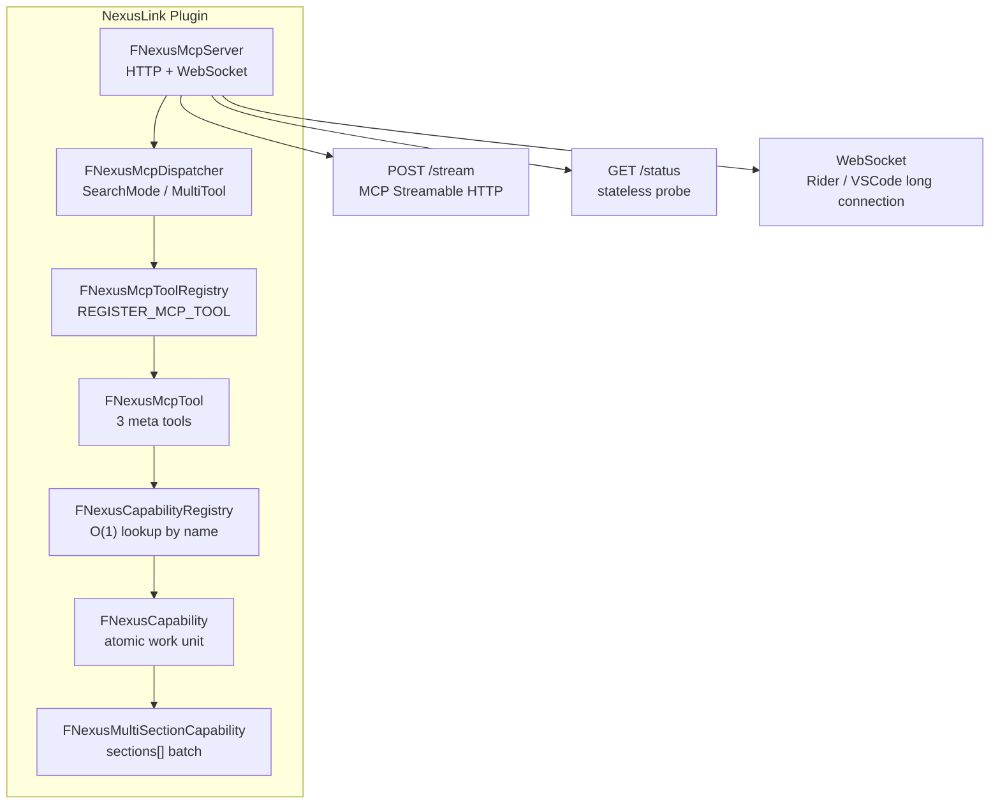

**Language / Language**: [简体中文](README.md) · **English**

# NexusLink — UE MCP Plugin

An MCP integration plugin for Unreal Engine that exposes UE project context to AI tools via the MCP protocol.

> Supports UE 4.26 and all later versions (including UE5)

## Architecture Overview



### Exposure Modes (ToolsListMode)

| Mode | tools/list returns | initialize.instructions | Use case |
|---|---|---|---|
| **SearchMode** (default) | 3 meta tools | `InitializeInstructions.SearchMode.md` (full routing table) | AI discovers capabilities on demand via `search_capabilities` |
| **MultiTool** | All enabled Capabilities (each as a separate Tool) + `submit_feedback` | `InitializeInstructions.MultiTool.md` (concise constraints) | Scenarios that need tools/list to enumerate all capabilities at once |

Mode switch path: Editor → Editor Preferences → Plugins → NexusLink → **Tools List Mode**. When Capabilities change, `notifications/tools/list_changed` is broadcast automatically.

## Installation & Enablement

Download `nexus-mcp-unreal-<version>.zip` from [NexusLink Releases](https://github.com/bytepine/NexusLink/releases), or clone this repository into your project's `Plugins/Developer/NexusLink`.

1. Place the plugin in your project's `Plugins/Developer/NexusLink`, then enable it under **Edit → Plugins → Developer → NexusLink**
2. After restarting the editor, open **Edit → Editor Preferences → Plugins → NexusLink**
3. Check **Enable MCP Server** (**off by default**) — once checked, HTTP (`POST /stream`) and WebSocket start immediately and the instance is registered for Rider/VSCode discovery; unchecking stops them immediately, **no editor restart required**

> GAS / Niagara Capabilities require `GameplayAbilities` / `Niagara` enabled in the project `.uproject` (`NexusLink.uplugin` declares these dependencies). StateTree / MVVM Capabilities require UE 5.5+ with the corresponding engine plugins available.

When unchecked: the toolbar shows no port, IDE proxies cannot discover the instance, and AI direct connections to `http://127.0.0.1:45000/stream` get no response. See the full user guide at [docs/usage-guide.md](docs/usage-guide.md) §2.

## Example Project

Public sample project [NexusUnreal](https://github.com/bytepine/NexusUnreal) (ThirdPerson template + UnLua + MCP regression tests). The plugin is mounted as a git submodule and **is not bundled** with the example repo; clone with `--recurse-submodules` or install the plugin separately.

## Using with IDE Proxies

NexusLink is the **UE-side plugin** (HTTP `:45000` + WebSocket `:55000`). For daily development, use an **IDE proxy** to scan UE instances, keep long-lived connections, and switch between Editor/PIE targets; your AI client only needs a fixed proxy port.

### Get a client proxy / desktop app (marketplace recommended)

| Client | Recommended | Fallback |
|--------|-------------|----------|
| **NexusRider** | [JetBrains Marketplace](https://plugins.jetbrains.com/plugin/32499-nexus-mcp) — Rider **Settings → Plugins → Marketplace**, search **Nexus MCP** | [GitHub Releases](https://github.com/bytepine/NexusRider/releases) zip |
| **NexusVSCode** | Search **Nexus MCP** in Extensions — [Open VSX](https://open-vsx.org/extension/byteyang/nexus-mcp-vscode) (Cursor / CodeBuddy / Windsurf) · [VS Marketplace](https://marketplace.visualstudio.com/items?itemName=byteyang.nexus-mcp-vscode) | [GitHub Releases](https://github.com/bytepine/NexusVSCode/releases) `.vsix` |
| **NexusDesktop** | [GitHub Releases](https://github.com/bytepine/NexusDesktop/releases) — `.zip` (Windows) / `.dmg` (macOS) | — |

> **NexusRider / NexusVSCode**: prefer marketplace installs for automatic updates. **NexusDesktop**: a standalone desktop app — no IDE plugin needed, just double-click to run, then it lives in the system tray.

| Access | Endpoint | For |
|--------|----------|-----|
| **NexusDesktop** | `http://127.0.0.1:6700/stream` | Standalone desktop app, no IDE needed, double-click to start |
| **Rider proxy** | `http://127.0.0.1:6800/stream` | JetBrains Rider |
| **VSCode/Cursor proxy** | `http://127.0.0.1:6900/stream` | VSCode / Cursor / CodeBuddy / Windsurf |
| **Direct to UE** | `http://127.0.0.1:45000/stream` | No proxy; manage UE ports yourself |

Source & docs: [NexusDesktop](https://github.com/bytepine/NexusDesktop) · [NexusRider](https://github.com/bytepine/NexusRider) · [NexusVSCode](https://github.com/bytepine/NexusVSCode)

### Recommended setup

1. **UE**: Install and enable this plugin (above), check **Enable MCP Server**
2. **Client**: Choose any of the following
   - **NexusDesktop** (no IDE needed): download from [Releases](https://github.com/bytepine/NexusDesktop/releases), run it, enable the proxy server in the tray menu
   - **Rider**: Install **Nexus MCP** from Marketplace → `Settings → Tools → Nexus MCP → Enable Nexus MCP server` (after **Open Project**)
   - **VSCode/Cursor**: Install **Nexus MCP** from Extensions → `Settings → nexusMcp.enabled = true`
3. **AI client**: Point MCP config at the corresponding port

```json
{
  "mcpServers": {
    "nexus-unreal": {
      "url": "http://127.0.0.1:6700/stream"
    }
  }
}
```

| Client | URL |
|--------|-----|
| NexusDesktop | `http://127.0.0.1:6700/stream` |
| Rider proxy | `http://127.0.0.1:6800/stream` |
| VSCode/Cursor proxy | `http://127.0.0.1:6900/stream` |

Proxies connect to UE over WebSocket; tool capabilities match direct mode.

> **NexusDesktop**: only two layers — UE **Enable MCP Server** + Desktop **Enable proxy** + AI client MCP config.
> **IDE proxies**: all three layers must be on — UE **Enable MCP Server** → IDE proxy **enabled** → AI client MCP config. **If any layer is off, nothing works.**
>
> Full install, status bar, and multi-instance switching: [docs/usage-guide.md](docs/usage-guide.md) §3 (Rider), §4 (VSCode/Cursor).

---

## Development

**Path A — Pure Tool** (lightweight tools without sections; override `ExecuteImpl` directly)
1. Create `Private/Tools/<module>/NexusMcpToolXxx.h/.cpp`, inheriting `FNexusMcpTool`
2. Implement `GetName()` / `GetDescription()` / `ExecuteImpl()`
3. At the end of `.cpp`: `REGISTER_MCP_TOOL(FNexusMcpToolXxx)`

**Path B — Capability** (main path; business logic encapsulated in Capability, callable independently)
1. Create `Private/Capabilities/<category>/NexusXxxCapability.h/.cpp`, inheriting `FNexusCapability` (or `FNexusMultiSectionCapability` for multi-section)
2. Implement `BuildDefinition()` / `Execute()`; at the end of `.cpp`: `REGISTER_MCP_CAPABILITY(FNexusXxxCapability)`
3. Follow [Resources/CapabilitySpec.md](Resources/CapabilitySpec.md) (naming / four-part description / self-check checklist)
4. Capabilities are invoked directly via the `call_capability` meta tool, or exposed as standalone MCP Tools in MultiTool mode

---

## Feature Coverage

> Full parameter reference: [docs/tool-reference.md](docs/tool-reference.md).

### Meta Tools (3)

- `search_capabilities` — Discover Capabilities by intent or name (check `errorKind` on failure)
- `call_capability` — Execute a Capability; single or batch `calls[]`
- `submit_feedback` — Report usage friction to drive improvements

### Coverage

| Domain | Capabilities | Version Gate |
|--------|-------------|-------------|
| **Editor Context** | Editor info/context, output log, console variables, viewport capture, asset CRUD/search/refs, PIE control, Gameplay Tags | All versions |
| **Blueprint** | Blueprint variables / functions / graph nodes / wiring / components / CDO batch edit | All versions |
| **Animation** | AnimSequence (keyframes/curves/notifies), AnimBlueprint (state machines), AnimMontage, BlendSpace (axes/samples), Skeleton / SkeletalMesh | All versions |
| **Material** | Material / MaterialInstance / MaterialFunction / MaterialParameterCollection | All versions |
| **Audio** | SoundWave, SoundCue, MetaSound Source/Patch (Frontend Document / graph wiring), SoundClass / SoundAttenuation / SoundConcurrency / SoundSubmix | MetaSound: 5.0+, Patch: 5.1+ |
| **AI** | BehaviorTree / Blackboard / EQS (Environment Query) / runtime AI state | All versions |
| **GAS** | GameplayAbility / GameplayEffect / AttributeSet + runtime ASC | Requires `GameplayAbilities` plugin |
| **Control Binding** | ControlRig (hierarchy + RigVM graph nodes/wiring), IKRig / IKRetargeter | UE 5.0+ |
| **Procedural / Motion** | PCG Graph (nodes/edges), PoseSearch (schema/database) | UE 5.4+ |
| **Layout / Data** | Struct, DataAsset, DataTable, Widget/UMG (widget tree/animations) | All versions |
| **State / ViewModel** | StateTree (states/tasks/conditions/transitions), MVVM ViewModel / Binding | UE 5.5+ |
| **Physics / Sequencer** | PhysicsAsset (bodies/constraints), LevelSequence (bindings/tracks) | All versions |
| **Engine Core Assets** | Curve (Float/Vector/LinearColor/CurveTable), UserDefinedEnum, AnimComposite, PhysicalMaterial, TextureRenderTarget2D | All versions |
| **World Partition** | DataLayerAsset (type / debug color) | UE 5.1+ |
| **VFX** | NiagaraSystem (emitters/user parameters) | Requires Niagara plugin |
| **Runtime** | Actor list/spawn/destroy/property read-write/diff; Widget runtime ops; AnimInstance state; GAS runtime ASC | Requires PIE/Game |
| **Lua** | UnLua eval/dofile/hot-reload/globals/call stack/memory | Requires UnLua plugin |

---

## Server Framework Features

- [x] MCP Streamable HTTP (`POST /stream`), per-session isolation (`Mcp-Session-Id`), multi-client concurrency safe
- [x] `GET /status` — Stateless probe endpoint (project name, engine version, WS port, `netRole`)
- [x] WebSocket server (default from 55000), for Rider / VSCode proxy long connections; `nexus/instructions` returns `InitializeInstructions.*.md` per ToolsListMode; `nexus/proxy_config` returns `ProxyConfig.json` (connection tool description, initialize prefix, error messages — fetched dynamically by proxies)
- [x] **SearchMode** (default): tools/list exposes only 3 meta tools; AI discovers capabilities on demand via `search_capabilities`
- [x] **MultiTool**: tools/list exposes all enabled Capabilities (each as a separate MCP Tool) + `submit_feedback`; no `search_capabilities` / `call_capability`
- [x] Broadcast `notifications/tools/list_changed` on Capability change or mode switch
- [x] **Enable MCP Server** master switch (off by default): Editor Preferences → Plugins → NexusLink → Server; checking starts HTTP/WebSocket immediately and registers instance
- [x] Auto port allocation with conflict fallback; instance registration for zero-scan discovery (`{PID}.json` written to temp directory)
- [x] **Per-Capability enable/disable** (`IsCapabilityEnabled`): Editor Preferences → Plugins → NexusLink → Capabilities; category-level / per-item toggles
- [x] **Response default-value compaction for all tools** (`FNexusResponseCompactorUtils`): recursively scans object array fields, extracts dominant values as `<field>_defaults` to reduce response size; can be globally disabled via settings panel **Response Default Compaction**
- [x] **AI feedback loop**: auto telemetry on `search_capabilities` / `call_capability` + manual `submit_feedback`; data stored locally under `<ProjectRoot>/.nexus-feedback/`; settings panel **Export Markdown** report and **Create GitHub Issue** (configurable `FeedbackIssueRepo`). See [usage-guide §2.5](docs/usage-guide.md)
- [x] **Plugin version check**: settings panel **Plugin Info** shows current version; manual **Check for Updates** and **check on startup** (on by default); notification with link to [Releases](https://github.com/bytepine/NexusLink/releases) when newer

---

## Related Documentation

- [docs/usage-guide.md](docs/usage-guide.md) — User install, settings panel, and IDE proxy setup
- [docs/architecture.md](docs/architecture.md) — Architecture (layering, Capability system, registration & dispatch)
- [docs/tool-reference.md](docs/tool-reference.md) — Full Capability parameter reference (script-generated; update with `py scripts/build_tool_reference.py`)
- [Resources/CapabilitySpec.md](Resources/CapabilitySpec.md) — Capability metadata spec (naming / four-part description / self-check checklist)
- [Resources/InitializeInstructions.SearchMode.md](Resources/InitializeInstructions.SearchMode.md) — SearchMode workflow for AI handshake (**First Action** / Tool Model / Intent→Capability routing / Hard Rules)
- [Resources/InitializeInstructions.MultiTool.md](Resources/InitializeInstructions.MultiTool.md) — MultiTool mode concise constraints
- [Resources/AIRules.mdc](Resources/AIRules.mdc) — IDE-side AI workflow Rule template (copy to game project `.cursor/rules/`; see [usage-guide §2.8](docs/usage-guide.md))
- [docs/testing.md](docs/testing.md) — pytest E2E regression test suite
- [CHANGELOG.md](CHANGELOG.md) — Version changelog

## Testing

Two-layer automation framework:

- **L1 C++ Automation** (`Source/NexusLinkTests/`): pure utility functions + plugin load + Capability registry smoke + full `FNexusResponseCompactorUtils` assertions. Trigger manually via UEEditor-Cmd:

  ```bash
  UEEditor-Cmd YourProject.uproject -ExecCmds="Automation RunTests NexusLink.; Quit" -unattended -nullrhi -NoSound -NoSplash
  ```

- **L2 pytest E2E** (maintain in your game project's `Tests/` directory): end-to-end regression of all Capabilities via `call_capability` (invoked under SearchMode; does not depend on MultiTool):

  ```powershell
  pip install -r Tests/requirements.txt
  python Script/run_e2e.py --ue-url http://127.0.0.1:45000/stream
  ```

  Report output to `Saved/Logs/TestReport.xml`. Details in [docs/testing.md](docs/testing.md).

**When adding a Capability**: add at least one happy-path test in the corresponding phase file under your game project's `Tests/test_*.py`, using `client.call_capability("cap_name", {...})`.

## Local Packaging

```bash
py scripts/build_unreal.py --version <version> --output release/
```

Output: `release/nexus-mcp-unreal-<version>.zip` — extract to UE project `Plugins/Developer/`.

### Release (maintainers)

GitHub Release **body must come only** from the matching `CHANGELOG.md` section (CI via `scripts/extract_release_notes.py --verify`). Do not hand-write Release notes or use `gh release create`.

**Stable** (`X.Y.Z`):

1. Archive `[Unreleased]` → `[X.Y.Z] - YYYY-MM-DD`, update `VERSION`
2. `py scripts/extract_release_notes.py --version X.Y.Z --verify` (preview stdout)
3. `git commit` → `git tag -a nexus-link-vX.Y.Z` → `git push origin HEAD` + `git push origin nexus-link-vX.Y.Z`

**Pre-release** (`X.Y.Z-beta.N`): same steps; tag `nexus-link-vX.Y.Z-beta.N`; CI creates a GitHub **Pre-release**.

Pushing the tag triggers `.github/workflows/release.yml` to package `nexus-mcp-unreal-<ver>.zip` and publish the Release.

## License

[MIT](LICENSE) © byteyang

> When adding or modifying Capabilities, sync this feature list and run `py scripts/build_tool_reference.py` to regenerate `docs/tool-reference.md`.
