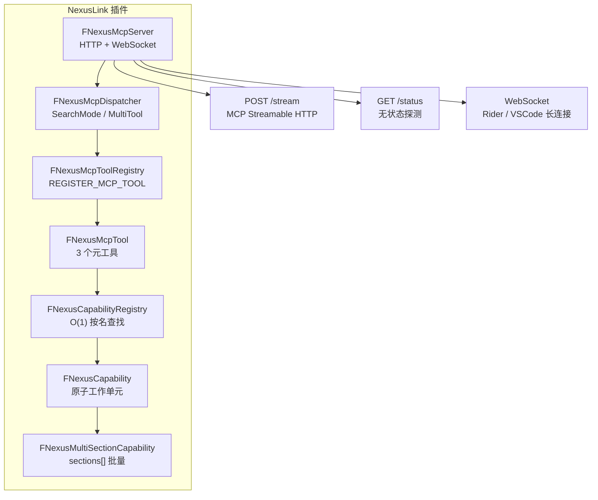

# NexusLink — UE MCP 插件

**语言 / Language**: **简体中文** · [English](README.en.md)

基于 Unreal Engine 的 MCP 集成插件，将 UE 项目上下文通过 MCP 协议暴露给 AI 工具。

> 支持 UE 4.26 及以上所有版本（含 UE5）

## 架构概览



### 暴露模式（ToolsListMode）

| 模式 | tools/list 返回 | initialize.instructions | 适用场景 |
|---|---|---|---|
| **SearchMode**（默认） | 3 个元工具 | `InitializeInstructions.SearchMode.md`（完整路由表） | AI 按需 `search_capabilities` 发现 |
| **MultiTool** | 全部已启用 Capability（各作独立 Tool）+ `submit_feedback` | `InitializeInstructions.MultiTool.md`（精简约束） | 需要 tools/list 一次性枚举所有能力的场景 |

模式切换路径：Editor → Editor Preferences → Plugins → NexusLink → **工具列表模式**。Capability 变更时自动广播 `notifications/tools/list_changed`。

## 安装与启用

从 [NexusLink Releases](https://github.com/bytepine/NexusLink/releases) 下载 `nexus-mcp-unreal-<version>.zip`，或克隆本仓库到项目的 `Plugins/Developer/NexusLink`。

1. 将插件放入项目的 `Plugins/Developer/NexusLink`，在 **Edit → Plugins → Developer → NexusLink** 中启用
2. 重启编辑器后，打开 **Edit → Editor Preferences → Plugins → NexusLink**
3. 勾选 **启用 MCP 服务器**（**默认关闭**）——勾选后即时启动 HTTP（`POST /stream`）与 WebSocket，并注册实例供 Rider/VSCode 发现；取消勾选立即停止，**无需重启编辑器**

> GAS / Niagara 相关 Capability 需在项目 `.uproject` 中启用 `GameplayAbilities` / `Niagara` 插件（`NexusLink.uplugin` 已声明依赖）。StateTree / MVVM 能力需 UE 5.5+ 且引擎内置对应插件可用。

未勾选时：工具栏不显示端口、IDE 代理扫描不到实例、AI 直连 `http://127.0.0.1:45000/stream` 无响应。完整用户指南见 [docs/usage-guide.md](docs/usage-guide.md) §2。

## 示例工程

公开示例项目 [NexusUnreal](https://github.com/bytepine/NexusUnreal)（ThirdPerson 模板 + UnLua + MCP 回归测试）。插件以子模块挂载，**不随示例仓分发插件本体**；克隆须 `--recurse-submodules` 或单独安装插件。

## 与 IDE 代理配合使用

NexusLink 是 **UE 侧插件**（提供 HTTP `:45000` + WebSocket `:55000`）。日常开发推荐搭配 **IDE 代理**，由代理负责扫描 UE 实例、维持长连接、在多 Editor/PIE 间切换；AI 客户端只需连代理的固定端口。

### 获取客户端代理 / 桌面程序（推荐商店安装）

| 客户端 | 推荐安装方式 | 备用 |
|--------|-------------|------|
| **NexusRider** | [JetBrains Marketplace](https://plugins.jetbrains.com/plugin/32499-nexus-mcp) — Rider **Settings → Plugins → Marketplace** 搜索 **Nexus MCP** | [GitHub Releases](https://github.com/bytepine/NexusRider/releases) 下载 zip |
| **NexusVSCode** | 扩展商店搜索 **Nexus MCP** — [Open VSX](https://open-vsx.org/extension/byteyang/nexus-mcp-vscode)（Cursor / CodeBuddy / Windsurf 等）· [VS Marketplace](https://marketplace.visualstudio.com/items?itemName=byteyang.nexus-mcp-vscode) | [GitHub Releases](https://github.com/bytepine/NexusVSCode/releases) 下载 `.vsix` |
| **NexusDesktop** | [GitHub Releases](https://github.com/bytepine/NexusDesktop/releases) 下载 `.zip`（Windows）/ `.dmg`（macOS） | — |

> **NexusRider / NexusVSCode** 优先从商店安装，可自动更新；**NexusDesktop** 是独立桌面程序，无需安装任何 IDE 插件，双击运行后在系统托盘常驻。

| 接入方式 | 端点 | 适用 |
|----------|------|------|
| **NexusDesktop** | `http://127.0.0.1:6700/stream` | 独立桌面程序，无需 IDE 插件，双击启动 |
| **Rider 代理** | `http://127.0.0.1:6800/stream` | JetBrains Rider |
| **VSCode/Cursor 代理** | `http://127.0.0.1:6900/stream` | VSCode / Cursor / CodeBuddy / Windsurf |
| **直连 UE** | `http://127.0.0.1:45000/stream` | 不用任何代理；须自行指定 UE 端口 |

源码与详细说明：[NexusDesktop](https://github.com/bytepine/NexusDesktop) · [NexusRider](https://github.com/bytepine/NexusRider) · [NexusVSCode](https://github.com/bytepine/NexusVSCode)

### 推荐配合流程

1. **UE 侧**：安装并启用本插件（见上一节），勾选 **启用 MCP 服务器**
2. **客户端侧**：选择以下任意一种接入方式
   - **NexusDesktop**（无需 IDE）：从 [Releases](https://github.com/bytepine/NexusDesktop/releases) 下载，双击运行，在托盘启用中转服务器
   - **Rider**：Marketplace 安装 **Nexus MCP** → `Settings → Tools → Nexus MCP → 启用 Nexus MCP 服务器`（须 **Open Project** 后）
   - **VSCode/Cursor**：扩展商店安装 **Nexus MCP** → `Settings → nexusMcp.enabled = true`
3. **AI 客户端**：MCP 配置指向对应端口

```json
{
  "mcpServers": {
    "nexus-unreal": {
      "url": "http://127.0.0.1:6700/stream"
    }
  }
}
```

| 客户端 | URL |
|--------|-----|
| NexusDesktop | `http://127.0.0.1:6700/stream` |
| Rider 代理 | `http://127.0.0.1:6800/stream` |
| VSCode/Cursor 代理 | `http://127.0.0.1:6900/stream` |

代理经 WebSocket 连 UE，工具能力与直连一致。

> **NexusDesktop**：仅需 UE **启用 MCP 服务器** + Desktop **启用中转服务器** + AI 客户端 MCP 配置，共两层开关。
> **IDE 代理**：三层总开关须全部开启：UE **启用 MCP 服务器** → IDE 代理 **启用** → AI 客户端 MCP 配置。**任一层关闭则不可用。**
>
> 详细安装、状态栏、多实例切换见 [docs/usage-guide.md](docs/usage-guide.md) §3（Rider）、§4（VSCode/Cursor）。

---

## 开发

**路径 A — 纯 Tool**（轻量无 section 工具，直接重写 `ExecuteImpl`）
1. 创建 `Private/Tools/<模块>/NexusMcpToolXxx.h/.cpp`，继承 `FNexusMcpTool`
2. 实现 `GetName()` / `GetDescription()` / `ExecuteImpl()`
3. `.cpp` 末尾 `REGISTER_MCP_TOOL(FNexusMcpToolXxx)`

**路径 B — Capability**（主流路径，业务逻辑封装在 Capability，可独立调用）
1. 创建 `Private/Capabilities/<分类>/NexusXxxCapability.h/.cpp`，继承 `FNexusCapability`（多 section 则继承 `FNexusMultiSectionCapability`）
2. 实现 `BuildDefinition()` / `Execute()`；`.cpp` 末尾 `REGISTER_MCP_CAPABILITY(FNexusXxxCapability)`
3. 遵循 [Resources/CapabilitySpec.md](Resources/CapabilitySpec.md)（命名 / 四段式描述 / 自检清单）
4. Capability 通过 `call_capability` 元工具直接调用，或在 MultiTool 模式下作为独立 MCP Tool 暴露

---

## 功能覆盖

> 完整参数手册见 [docs/tool-reference.md](docs/tool-reference.md)。

### 元工具（3 个）

- `search_capabilities` — 按意图/名称发现 Capability（失败看 `errorKind`）
- `call_capability` — 执行 Capability，支持单条/批量 `calls[]`
- `submit_feedback` — 上报使用摩擦，驱动改进

### 覆盖领域

| 领域 | 能力范围 | 版本门控 |
|------|---------|---------|
| **编辑器上下文** | 编辑器信息/上下文、输出日志、控制台变量、视口截图、资产增删改/搜索/引用查询、PIE 控制、Gameplay Tags | 全版本 |
| **蓝图** | Blueprint 变量/函数/图节点/连线/组件/CDO 批量编辑 | 全版本 |
| **动画** | AnimSequence（关键帧/曲线/Notify）、AnimBlueprint（状态机）、AnimMontage（Segment/Section）、BlendSpace（轴/样本）、Skeleton / SkeletalMesh | 全版本 |
| **材质** | Material / MaterialInstance / MaterialFunction / MaterialParameterCollection | 全版本 |
| **音频** | SoundWave、SoundCue、MetaSound Source/Patch（Frontend Document / 图节点连线）、SoundClass / SoundAttenuation / SoundConcurrency / SoundSubmix | MetaSound/Patch: UE 5.0+/5.1+ |
| **AI** | BehaviorTree / Blackboard / EQS（环境查询）/ 运行时 AI 执行状态 | 全版本 |
| **GAS** | GameplayAbility / GameplayEffect / AttributeSet + 运行时 ASC | 需 `GameplayAbilities` 插件 |
| **控制绑定** | ControlRig（Rig 层级 + RigVM 图节点/连线）、IKRig / IKRetargeter | UE 5.0+ |
| **程序化/动作** | PCG Graph（节点/连线）、PoseSearch（schema/database） | UE 5.4+ |
| **布局/数据** | Struct、DataAsset、DataTable、Widget/UMG（控件树/动画）| 全版本 |
| **状态/视图模型** | StateTree（状态/任务/条件/转换）、MVVM ViewModel / Binding | UE 5.5+ |
| **物理 / 序列器** | PhysicsAsset（Body/Constraint）、LevelSequence（Binding/Track）| 全版本 |
| **引擎核心小资产** | Curve（Float/Vector/LinearColor/CurveTable）、UserDefinedEnum、AnimComposite、PhysicalMaterial、TextureRenderTarget2D | 全版本 |
| **World Partition** | DataLayerAsset（类型/调试颜色）| UE 5.1+ |
| **特效** | NiagaraSystem（发射器/用户参数） | 需 Niagara 插件 |
| **运行时** | Actor 列表/生成/销毁/属性读写/对比；Widget 运行时操作；AnimInstance 状态；GAS 运行时 ASC | 需 PIE/Game |
| **Lua** | UnLua eval/dofile/热重载/全局变量/调用栈/内存 | 需 UnLua 插件 |

---

## 服务器框架特性

- [x] MCP Streamable HTTP（`POST /stream`），per-session 会话隔离（`Mcp-Session-Id`），多客户端并发安全
- [x] `GET /status` — 无状态探测端点（项目名、引擎版本、WS 端口、`netRole`）
- [x] WebSocket 服务器（默认 55000 起），供 Rider / VSCode 代理长连接；`nexus/instructions` 按 ToolsListMode 返回 `InitializeInstructions.*.md`；`nexus/proxy_config` 返回 `ProxyConfig.json`（连接工具 description、initialize 前缀、错误文案，供代理动态拉取）
- [x] **SearchMode**（默认）：tools/list 仅暴露 3 个元工具，AI 通过 `search_capabilities` 按需发现能力
- [x] **MultiTool**：tools/list 暴露全部已启用 Capability（各作独立 MCP Tool）+ `submit_feedback`；无 `search_capabilities` / `call_capability`
- [x] Capability 变更或模式切换时广播 `notifications/tools/list_changed`
- [x] **启用 MCP 服务器**总开关（默认关闭）：Editor Preferences → Plugins → NexusLink → 服务器；勾选后即时启动 HTTP/WebSocket 并注册实例
- [x] 端口自动分配，冲突时自动切换；实例注册机制支持零扫描发现（`{PID}.json` 写入临时目录）
- [x] **按 Capability 启用/禁用**（`IsCapabilityEnabled`）：Editor Preferences → Plugins → NexusLink → Capabilities；支持分类级 / 单条级勾选
- [x] **全工具响应默认值压缩**（`FNexusResponseCompactorUtils`）：递归扫描对象数组字段，主流值自动抽取为 `<field>_defaults`，降低响应体积；可通过设置面板 `响应默认值压缩` 全局关闭
- [x] **AI 反馈闭环**：`search_capabilities` / `call_capability` 自动埋点 + `submit_feedback` 手动上报；数据落本地 `<ProjectRoot>/.nexus-feedback/`；设置面板可**导出 Markdown** 报告、**创建 GitHub Issue**（可配置 `FeedbackIssueRepo`）。详情见 [usage-guide §2.5](docs/usage-guide.md)
- [x] **插件版本检查**：设置面板「插件信息」显示当前版本；支持手动**检查更新**与**启动时自动检查**（默认开），有新版本时通知并跳转 [Releases](https://github.com/bytepine/NexusLink/releases)

---

## 相关文档

- [docs/usage-guide.md](docs/usage-guide.md) — 用户安装、设置面板与 IDE 代理接入指南
- [docs/architecture.md](docs/architecture.md) — 架构设计（分层职责、Capability 系统、注册与分发流程）
- [docs/tool-reference.md](docs/tool-reference.md) — Capability 完整参数手册（脚本生成，`py scripts/build_tool_reference.py` 更新）
- [Resources/CapabilitySpec.md](Resources/CapabilitySpec.md) — Capability 元数据规范（命名 / 描述四段式 / 自检清单）
- [Resources/InitializeInstructions.SearchMode.md](Resources/InitializeInstructions.SearchMode.md) — AI 握手时 SearchMode 工作流说明（**First Action** / Tool Model / Intent→Capability 路由 / Hard Rules）
- [Resources/InitializeInstructions.MultiTool.md](Resources/InitializeInstructions.MultiTool.md) — MultiTool 模式精简约束
- [Resources/AIRules.mdc](Resources/AIRules.mdc) — IDE 侧 AI 工作流 Rule 模板（复制到游戏项目 `.cursor/rules/`，见 [usage-guide §2.8](docs/usage-guide.md)）
- [docs/testing.md](docs/testing.md) — pytest E2E 回归测试套件
- [CHANGELOG.md](CHANGELOG.md) — 版本变更记录

## 测试

两层自动化框架：

- **L1 C++ Automation**（`Source/NexusLinkTests/`）：纯工具函数 + 插件加载 + Capability 注册表冒烟 + `FNexusResponseCompactorUtils` 全量断言。需通过 UEEditor-Cmd 手动触发：

  ```bash
  UEEditor-Cmd YourProject.uproject -ExecCmds="Automation RunTests NexusLink.; Quit" -unattended -nullrhi -NoSound -NoSplash
  ```

- **L2 pytest E2E**（在宿主推游戏工程的 `Tests/` 目录自行维护）：通过 `call_capability` 对所有 Capability 做端到端回归（SearchMode 下调用，不依赖 MultiTool）：

  ```powershell
  pip install -r Tests/requirements.txt
  python Script/run_e2e.py --ue-url http://127.0.0.1:45000/stream
  ```

  报告输出到 `Saved/Logs/TestReport.xml`。详情见 [docs/testing.md](docs/testing.md)。

**新增 Capability 时**：在宿主推游戏工程 `Tests/test_*.py` 对应阶段文件中同步添加至少一个 happy-path 用例，使用 `client.call_capability("cap_name", {...})` 调用形式。

## 本地打包

```bash
py scripts/build_unreal.py --version <version> --output release/
```

产物：`release/nexus-mcp-unreal-<version>.zip`，解压到 UE 项目 `Plugins/Developer/`。

### 发版（维护者）

GitHub Release **正文唯一来源**为 `CHANGELOG.md` 对应版本段落（CI 经 `scripts/extract_release_notes.py --verify` 提取）。禁止网页手写 Release 说明或 `gh release create`。

**正式版**（`X.Y.Z`）：

1. 归档 `[Unreleased]` → `[X.Y.Z] - YYYY-MM-DD`，更新 `VERSION`
2. `py scripts/extract_release_notes.py --version X.Y.Z --verify`（预览 stdout，确认无误）
3. `git commit` → `git tag -a nexus-link-vX.Y.Z` → `git push origin HEAD` + `git push origin nexus-link-vX.Y.Z`

**Pre-release**（`X.Y.Z-beta.N`）：步骤同上，tag 为 `nexus-link-vX.Y.Z-beta.N`；CI 创建 GitHub **Pre-release**。

push tag 后 `.github/workflows/release.yml` 打包 `nexus-mcp-unreal-<ver>.zip` 并发布 Release。

## License

[MIT](LICENSE) © byteyang

> 新增/修改 Capability 后运行 `py scripts/build_tool_reference.py` 重新生成 `docs/tool-reference.md`。
