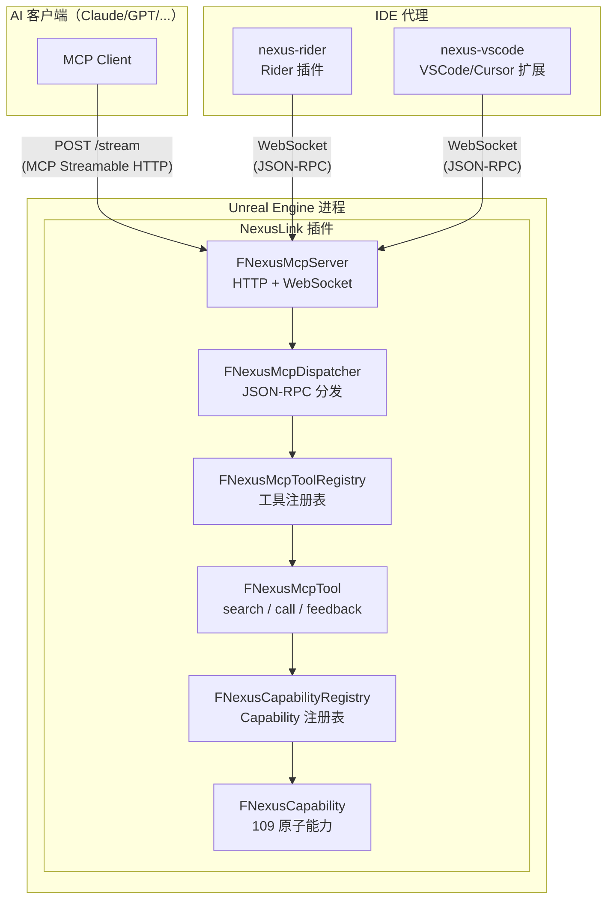
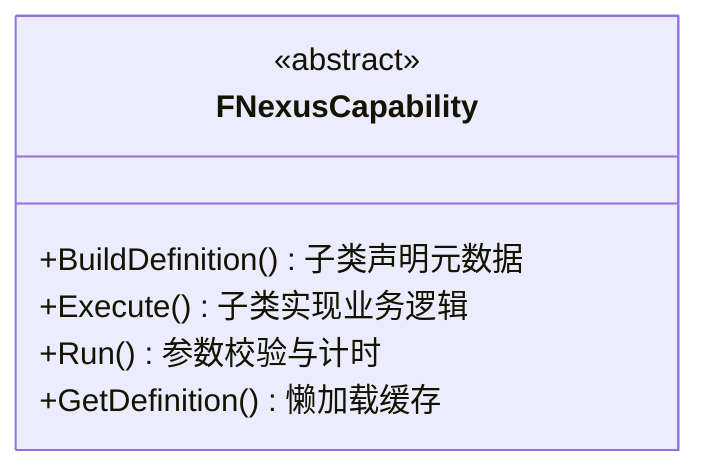
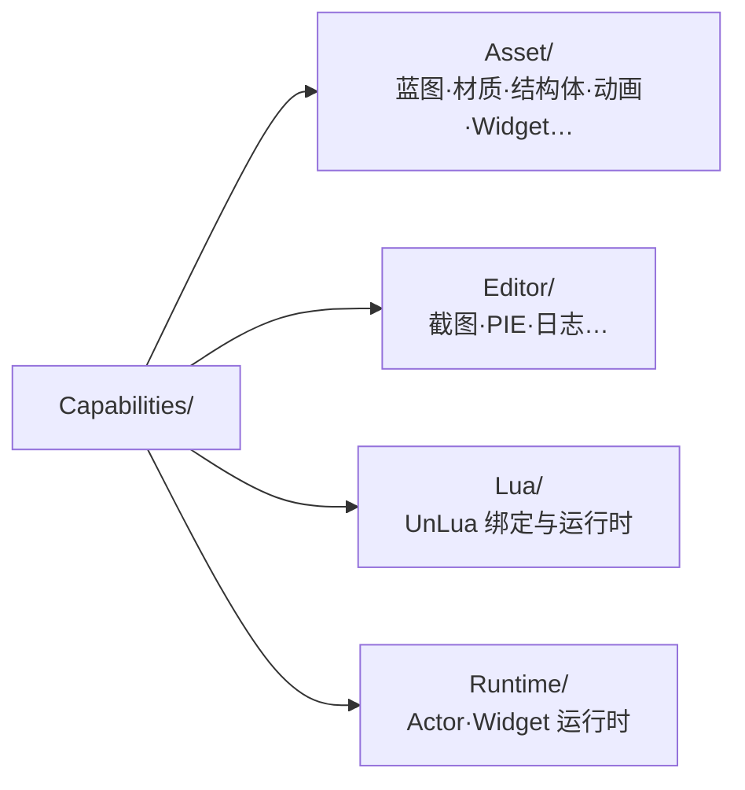
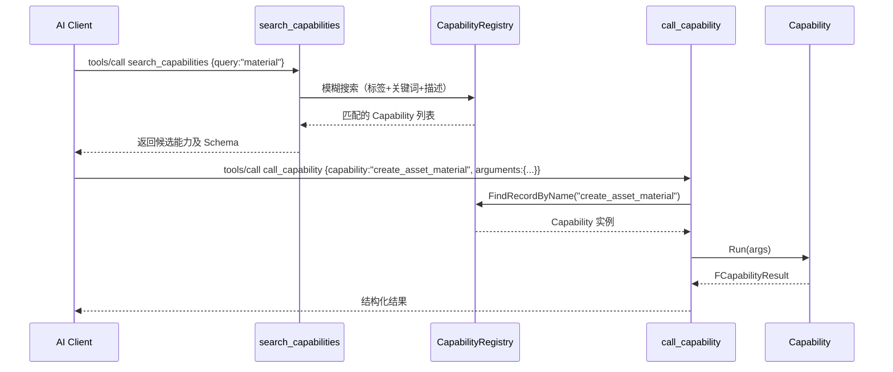
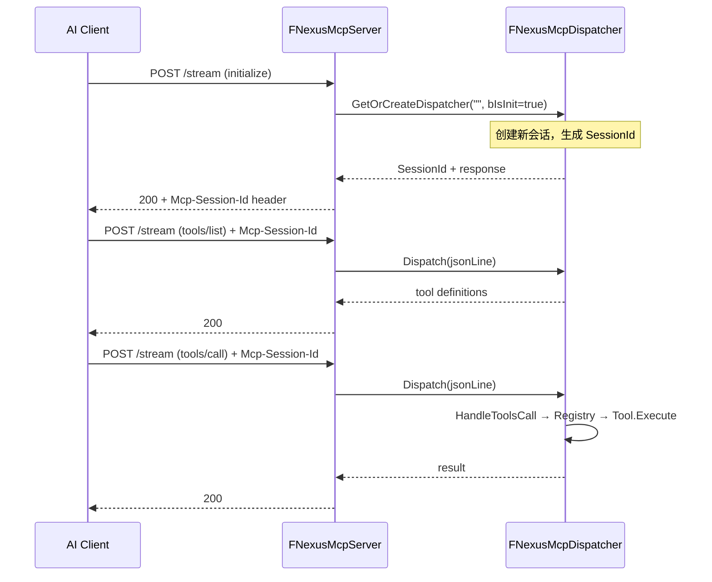
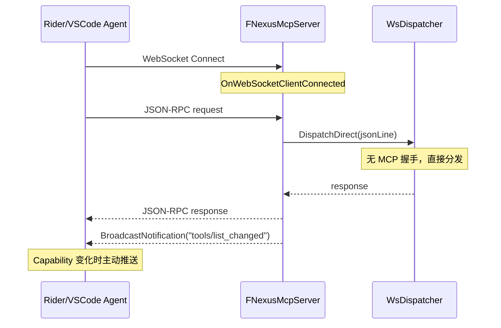

# NexusLink 架构设计文档

## 系统总架构



## MCP 服务器生命周期

`UNexusLinkSettings::bEnableMcpServer` 为总开关，**默认 `false`**。编辑器启动时若未勾选，不创建 `FNexusMcpServer`、不写入实例注册文件；用户在 **Editor Preferences → Plugins → NexusLink** 勾选后通过 `PostEditChangeProperty` 即时启停，无需重启。IDE 代理与 AI 直连均依赖此开关为真后 UE 才会监听 HTTP/WebSocket 端口。

## 分层职责

| 层次 | 组件 | 职责 |
|------|------|------|
| 网络层 | `FNexusMcpServer` | HTTP + WebSocket 服务器，管理连接与会话隔离（受 `bEnableMcpServer` 控制） |
| 协议层 | `FNexusMcpDispatcher` | JSON-RPC 2.0 解析、MCP 握手状态机、路由分发 |
| 注册层 | `FNexusMcpToolRegistry` / `FNexusCapabilityRegistry` | 全局单例注册表，O(1) 按名查找 |
| 工具层 | `FNexusMcpTool` | 3 个元工具：`search_capabilities` / `call_capability` / `submit_feedback` |
| 能力层 | `FNexusCapability` | 109 个原子工作单元（`WITH_GAS=0` 减 10；`WITH_NIAGARA=0` 再减 1；`WITH_STATETREE=0` / `WITH_MVVM=0` 各再减 1），按域分类 |

---

## Capability 系统设计

### 核心抽象



### 自注册机制

```cpp
// 在 .cpp 文件底部一行完成注册
REGISTER_MCP_CAPABILITY(FNexusSearchAssetCapability);
```

宏展开后利用 C++ 静态初始化，在模块加载期自动向全局注册表注册实例。新增 Capability 只需：
1. 在对应域目录下新建 .h/.cpp
2. 继承 `FNexusCapability`，实现 `BuildDefinition()` + `Execute()`
3. 文件底部添加 `REGISTER_MCP_CAPABILITY(ClassName)`

无需修改任何已有代码。

### 域分类目录



### Tool 与 Capability 解耦



AI 无需记忆全部 109 个 Capability 名称——先搜索再调用。

---

## 暴露模式（ToolsListMode）

NexusLink 支持两种 `tools/list` 暴露模式，可在 Editor Preferences → Plugins → NexusLink → 工具列表模式 切换：

| 模式 | tools/list 内容 | initialize.instructions | 适用场景 |
|------|----------------|-------------------------|---------|
| **SearchMode**（默认） | 3 个元工具 | `InitializeInstructions.SearchMode.md`（完整路由表 + 调用规范） | AI 通过 `search_capabilities` 按需发现，降低首次 token 开销 |
| **MultiTool** | `submit_feedback` + 全部已启用 Capability（各作独立 MCP Tool，最多 109 个） | `InitializeInstructions.MultiTool.md`（精简全局约束） | 需要客户端一次性枚举全部能力的场景 |

模式切换或 Capability 变更时，NexusLink 自动广播 `notifications/tools/list_changed`。

代理层（Rider/VSCode）连接 UE 后，通过 `nexus/instructions` 拉取 `InitializeInstructions.*.md`，通过 `nexus/proxy_config` 拉取 `ProxyConfig.json`（连接工具 description、initialize 前缀、错误文案），拼接到自身 `initialize.instructions` / `tools/list` 响应。

---

## 消息流

### HTTP MCP Streamable 通道



每个 HTTP 会话通过 `Mcp-Session-Id` 隔离，支持多 AI 客户端并发。

### WebSocket 代理通道（Rider/VSCode）



WebSocket 通道共享单一 `WsDispatcher`，无状态握手开销。

---

## 跨版本兼容策略

### 设计原则

NexusLink 支持 UE 4.26 ~ 5.8+。版本兼容通过语义宏实现，定义于 `NexusVersionCompat.h`。

### 机制

```cpp
// 基础版本数值化
#define NX_UE_VERSION       (ENGINE_MAJOR_VERSION * 100 + ENGINE_MINOR_VERSION)
#define NX_UE_AT_LEAST(M,m) (NX_UE_VERSION >= (M) * 100 + (m))

// 语义别名（按 API 变更点命名）
#define NX_UE_HAS_FTSTICKER            NX_UE_AT_LEAST(5, 0)
#define NX_UE_HAS_CLASS_PATHS          NX_UE_AT_LEAST(5, 1)
// ...更多见 docs/version-compat-reference.md
```

### 使用规范

- **禁止**在业务代码中直接使用 `ENGINE_MAJOR_VERSION` / `ENGINE_MINOR_VERSION`
- **必须**优先复用或新增 `NX_*` 语义宏
- 新增宏时在 `NexusVersionCompat.h` 顶部以注释形式标明对应 UE 版本和变更内容
- 详细宏参考表见 [version-compat-reference.md](./version-compat-reference.md)
