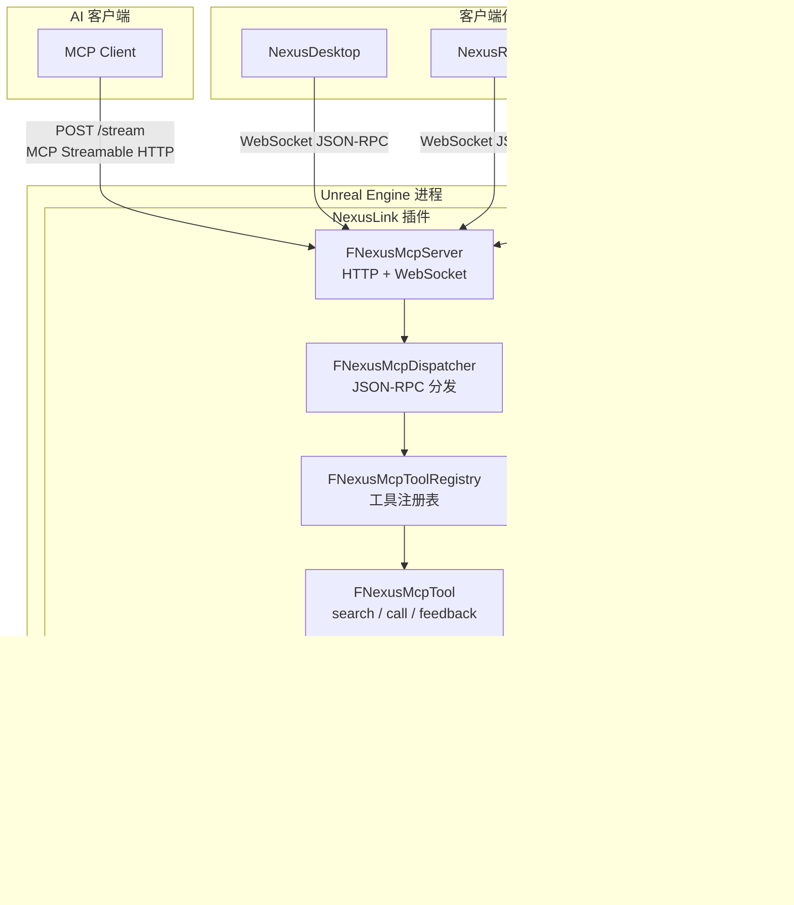
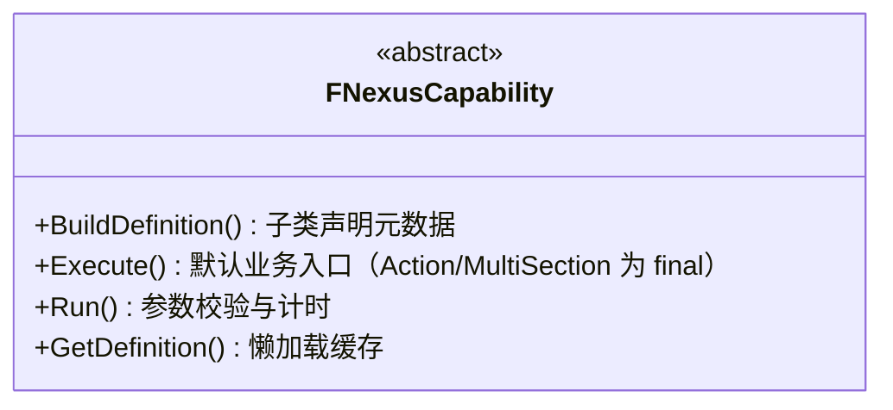
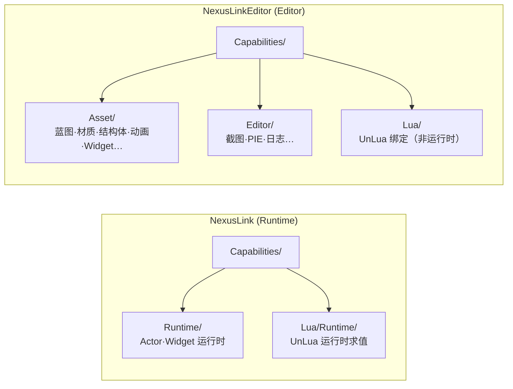
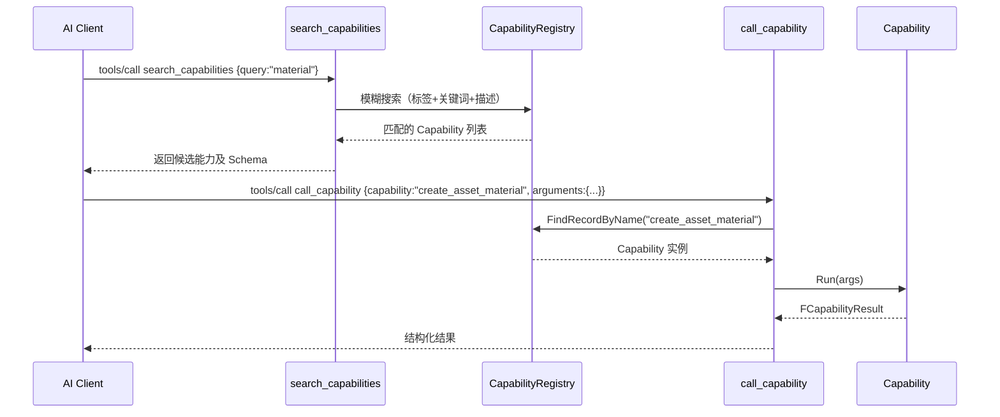
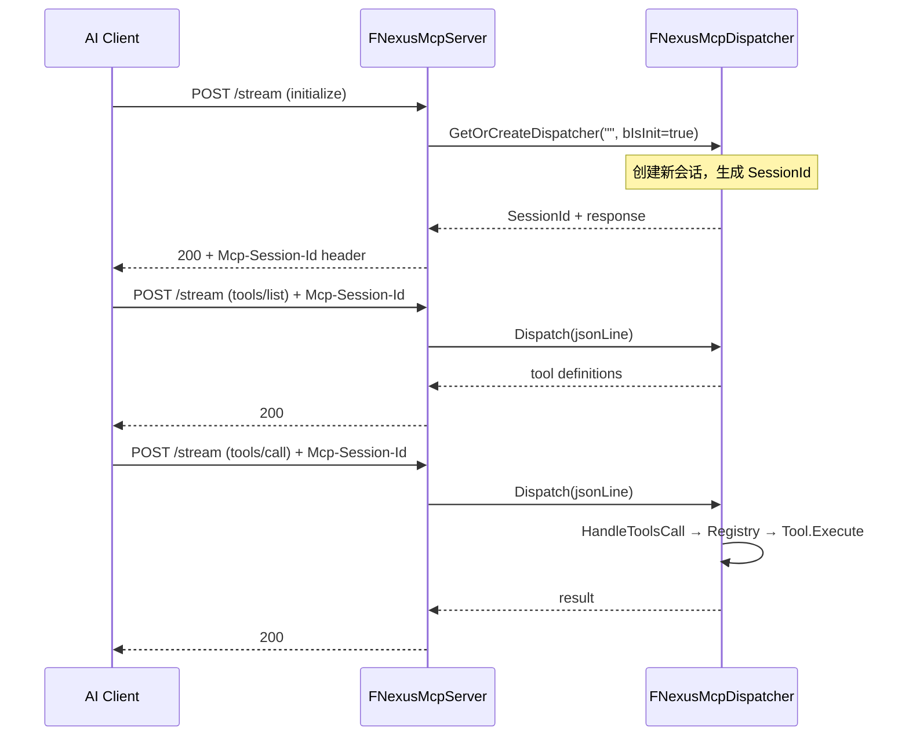
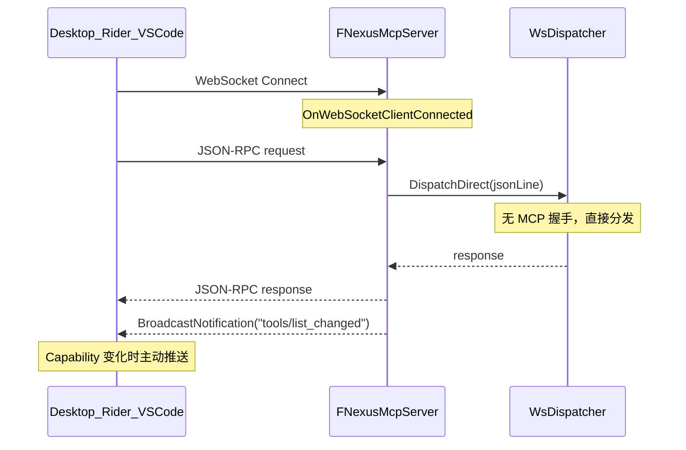

# NexusLink 架构设计文档

## 系统总架构


```mermaid
graph TB
    subgraph AI["AI 客户端"]
        MCP_Client[MCP Client]
    end

    subgraph Clients["客户端代理"]
        Desktop[NexusDesktop]
        Rider[NexusRider]
        VSCode[NexusVSCode]
    end

    subgraph UE["Unreal Engine 进程"]
        subgraph NexusLink["NexusLink 插件"]
            Server[FNexusMcpServer<br>HTTP + WebSocket]
            Dispatcher[FNexusMcpDispatcher<br>JSON-RPC 分发]
            ToolRegistry[FNexusMcpToolRegistry<br>工具注册表]
            CapRegistry[FNexusCapabilityRegistry<br>Capability 注册表]
            Tools[FNexusMcpTool<br>search / call / feedback]
            Caps[FNexusCapability]
        end
    end

    MCP_Client -->|"POST /stream<br>MCP Streamable HTTP"| Server
    Desktop -->|"WebSocket JSON-RPC"| Server
    Rider -->|"WebSocket JSON-RPC"| Server
    VSCode -->|"WebSocket JSON-RPC"| Server
    Server --> Dispatcher
    Dispatcher --> ToolRegistry
    ToolRegistry --> Tools
    Tools --> CapRegistry
    CapRegistry --> Caps
```

四端端口与开关层数见 [usage-guide §1](./usage-guide.md)。Capability 清单以 `search_capabilities` / [tool-reference.zh.md](./tool-reference.zh.md) 为准，勿在本文手写总数。
## MCP 服务器生命周期

`UNexusLinkSettings::bEnableMcpServer` 为总开关，**默认 `false`**。另支持命令行 **`-EnableNexusMcp`** 与控制台 **`NexusLink.EnableMcp 1|0`**（均会话级，不写盘）；与 Preferences 为 OR。cooked Game/DS 额外支持 **`-NexusMcpPort=`** / **`-NexusWsPort=`** / **`-NexusAllowLan`** 覆盖默认端口与 LAN 绑定。插件拆两个模块：`NexusLink`（**`Type: Runtime`**，可进 cooked Game/DS）承载 Server / Dispatcher / Registry / 3 个元工具 / Runtime cap；`NexusLinkEditor`（**`Type: Editor`**，仅编辑器二进制加载）承载 Editor cap 与设置面板 / 状态栏 UI。`REGISTER_MCP_TOOL` / `REGISTER_MCP_CAPABILITY` 由 **`NEXUSLINK_WITH_SERVER`**（`!UE_BUILD_SHIPPING`）门控——Shipping 编译期整体剔除服务器与注册表。平台门控双写 `PlatformAllowList`（UE5）+ `WhitelistPlatforms`（UE4.2x）。设置面板 / 状态栏仅编辑器模块加载时注册；MCP 监听在 Development/DebugGame 的独立 Game/DS 与 editor-hosted `-server` 均可启动。未启用时不创建 `FNexusMcpServer`；Preferences 勾选后经 `PostEditChangeProperty` 即时启停。

**Capability 可见性**：完整 Editor 宿主暴露全部已启用 cap。cooked Game/DS（Development/DebugGame）仅暴露 `NexusLink` 模块的 Runtime cap（`FNexusRuntimeCapability` / `FNexusRuntimeMultiSectionCapability`），`NexusLinkEditor` 的 Editor cap 不参与编译，也就不会注册；Shipping 不含服务器，无 cap 暴露。

## 分层职责

| 层次 | 组件 | 职责 |
|------|------|------|
| 网络层 | `FNexusMcpServer` | HTTP + WebSocket 服务器，管理连接与会话隔离（受 `bEnableMcpServer` / `-EnableNexusMcp` 控制） |
| 协议层 | `FNexusMcpDispatcher` | JSON-RPC 2.0 解析、MCP 握手状态机、路由分发 |
| 注册层 | `FNexusMcpToolRegistry` / `FNexusCapabilityRegistry` | 全局单例注册表，O(1) 按名查找 |
| 工具层 | `FNexusMcpTool` | 3 个元工具：`search_capabilities` / `call_capability` / `submit_feedback` |
| 能力层 | `FNexusCapability` | 原子工作单元（插件门控 cap 按宿主裁剪），按域分类 |

---

## Capability 系统设计

### 核心抽象


```mermaid
classDiagram
    class FNexusCapability {
        <<abstract>>
        +BuildDefinition() 子类声明元数据
        +Execute() 默认业务入口（Action/MultiSection 为 final）
        +Run() 参数校验与计时
        +GetDefinition() 懒加载缓存
    }
```

`FNexusActionCapability` / `FNexusMultiSectionCapability` 将 `Execute` 标为 **final**；子类走 `RegisterActions` / `ExecuteSection`。基类选择见 [CapabilitySpec.md](../Resources/CapabilitySpec.md) §2.1.1。

### 自注册机制

```cpp
// 在 .cpp 文件底部一行完成注册
REGISTER_MCP_CAPABILITY(FNexusSearchAssetCapability);
```

宏展开后利用 C++ 静态初始化，在模块加载期自动向全局注册表注册实例。新增 Capability 只需：
1. 按 CapabilitySpec §2.1.0 **选模块**（PIE/Game 活对象、不落盘 → `NexusLink` Runtime 模块；磁盘资产 / 编辑器 API / 落盘 → `NexusLinkEditor` 模块）
2. 在对应模块 `Source/<模块>/Private/Capabilities/` 下的域目录新建 .h/.cpp
3. 按 CapabilitySpec §2.1.1 选基类（`manage_*` + `operations[]` → `FNexusActionCapability`，禁止 override `Execute`；其余见该表；基类范围随第 1 步选定的模块收窄）并实现对应钩子
4. 文件底部添加 `REGISTER_MCP_CAPABILITY(ClassName)`

无需修改任何已有代码。

### 域分类目录

两个模块各自的 `Private/Capabilities/` 均沿用相同的域分类结构（分组锚点不含模块名，设置面板 cap 树零感知模块拆分）：


```mermaid
flowchart LR
    subgraph RT["NexusLink (Runtime)"]
        RootRT["Capabilities/"]
        RootRT --> Runtime["Runtime/<br/>Actor·Widget 运行时"]
        RootRT --> LuaRT["Lua/Runtime/<br/>UnLua 运行时求值"]
    end
    subgraph ED["NexusLinkEditor (Editor)"]
        RootED["Capabilities/"]
        RootED --> Asset["Asset/<br/>蓝图·材质·结构体·动画·Widget…"]
        RootED --> Editor["Editor/<br/>截图·PIE·日志…"]
        RootED --> LuaED["Lua/<br/>UnLua 绑定（非运行时）"]
    end
```

### Tool 与 Capability 解耦


```mermaid
sequenceDiagram
    participant AI as AI Client
    participant Tool as search_capabilities
    participant Reg as CapabilityRegistry
    participant Call as call_capability
    participant Cap as Capability

    AI->>Tool: tools/call search_capabilities {query:"material"}
    Tool->>Reg: 模糊搜索（标签+关键词+描述）
    Reg-->>Tool: 匹配的 Capability 列表
    Tool-->>AI: 返回候选能力及 Schema

    AI->>Call: tools/call call_capability {capability:"create_asset_material", arguments:{...}}
    Call->>Reg: FindRecordByName("create_asset_material")
    Reg-->>Call: Capability 实例
    Call->>Cap: Run(args)
    Cap-->>Call: FCapabilityResult
    Call-->>AI: 结构化结果
```

AI 无需记忆全部 Capability 名称——先搜索再调用。

---

## 暴露模式（ToolsListMode）

NexusLink 支持两种 `tools/list` 暴露模式，可在 Editor Preferences → Plugins → NexusLink → 工具列表模式 切换：

| 模式 | tools/list 内容 | initialize.instructions | 适用场景 |
|------|----------------|-------------------------|---------|
| **SearchMode**（默认） | 3 个元工具 | `InitializeInstructions.SearchMode.md`（精简路由 / 硬规则） | AI 通过 `search_capabilities` 按需发现，降低每轮 tools/list token |
| **MultiTool** | `submit_feedback` + 全部已启用 Capability（各作独立 MCP Tool） | `InitializeInstructions.MultiTool.md`（精简全局约束） | 需要客户端一次性枚举全部能力的场景 |

MCP 客户端通常把 `tools/list` + `initialize.instructions` **每模型轮次**重新注入 prompt。固定开销粗估（以当时已注册 Capability 计、源码 schema 解析、chars÷4；不含 call 返回体与对话历史）：

| 分量 | SearchMode | MultiTool | 差额 |
|---|---|---|---|
| tools/list | 3 tools · ~0.3k tok | 全部已启用 cap + `submit_feedback` · ~21.5k tok | **+21.2k** |
| initialize.instructions | ~1.1k | ~0.7k | −0.4k |
| **每轮固定合计** | **~1.4k** | **~21.9k** | **~15.6× / +20.5k** |

- SearchMode：小 tools/list + 精简路由；按需 `search_capabilities` 换取单份 schema（「发现税」一次性）。
- MultiTool：instructions 略短，但把全部 Capability schema 每轮塞进 prompt（「全量 schema 税」每轮都付）。
- 典型任务累计（省略相同 call 返回）：已知 1×search+1×call 约 **4.6×**；中等 2×search+3×call 约 **5.5×**；重会话 4×search+8×call 约 **6.1×**。即便零次 search、只靠路由直调，固定税仍恒约 **15.6×**。

**建议**：日常与长会话保持 **SearchMode**。仅当客户端无法遵循 search→call、或必须一次枚举全 Tool 时再切 MultiTool，并尽量关掉无关 Capability。UE 在线时可用宿主工程 `Script/measure_token_baseline.py` 复核 live `tools/list`。

模式切换或 Capability 变更时，NexusLink 自动广播 `notifications/tools/list_changed`。

代理层（Desktop / Rider / VSCode）连接 UE 后，通过 `nexus/instructions` 拉取 `InitializeInstructions.*.md`，通过 `nexus/proxy_config` 拉取 `ProxyConfig.json`（连接工具 description、initialize 前缀、错误文案），拼接到自身 `initialize.instructions` / `tools/list` 响应。代理另实现会话层（TTL 缓存、断线快照、写门控、Pause），契约见 [proxy-session.md](./proxy-session.md)；直连 `:45000` 无此层。

---

## 消息流

### HTTP MCP Streamable 通道


```mermaid
sequenceDiagram
    participant C as AI Client
    participant S as FNexusMcpServer
    participant D as FNexusMcpDispatcher

    C->>S: POST /stream (initialize)
    S->>D: GetOrCreateDispatcher("", bIsInit=true)
    Note over D: 创建新会话，生成 SessionId
    D-->>S: SessionId + response
    S-->>C: 200 + Mcp-Session-Id header

    C->>S: POST /stream (tools/list) + Mcp-Session-Id
    S->>D: Dispatch(jsonLine)
    D-->>S: tool definitions
    S-->>C: 200

    C->>S: POST /stream (tools/call) + Mcp-Session-Id
    S->>D: Dispatch(jsonLine)
    D->>D: HandleToolsCall → Registry → Tool.Execute
    D-->>S: result
    S-->>C: 200
```

每个 HTTP 会话通过 `Mcp-Session-Id` 隔离，支持多 AI 客户端并发。并发会话数达设置里的上限（默认 16，0=不限制）时，`GetOrCreateDispatcher` 驱逐最久未活动（`LastActivityAt`）的会话，保证新客户端总能握手成功；被驱逐会话再来请求会按已有的 404 `session_not_found` 处理。

HTTP 收包线程只拷贝请求体与 header，然后 `AsyncTask` 回切 GameThread 再碰 `HttpSessions` / `Dispatch` / `DetectCurrentNetRole`，并用推迟的 `OnComplete` 回写响应（不再 `FEvent::Wait` 阻塞收包线程）。`GET /status` 同样回切 GameThread，避免非 GT 读 `GEngine->GetWorldContexts()`。

### 同步执行模型与已知限制

`tools/call` 从 `Dispatch`/`DispatchDirect` 到 `EmitToolResult` 全程同步跑在 GameThread，回切只发生在收发两端（见上），执行期间不会让出。重 capability（蓝图编译、资产落盘、`FlushRenderingCommands` 截图、全表资产扫描）会让整个编辑器同帧掉帧——这是相关 UE API 本身仅限 GameThread 调用的直接后果，非 NexusLink 传输层的实现缺陷，也没有切片/异步空间。

HTTP `/stream` 是无状态 request-response，没有 SSE/chunked 等推送通道；WebSocket 虽可 `BroadcastNotification` 推送，但三个代理目前只识别 `notifications/tools/list_changed`，其余通知一律丢弃。因此长任务无法用「返回 pending + 事后推送」的方式实现——唯一现实路径是让请求原样挂着，直到 capability 跑完。

代理侧（Desktop/Rider/VSCode）对 `tools/call` 统一 120s 超时且超时不重试；同一长连接上的请求还会串行排队，一个慢调用会连带堵塞同会话的后续请求。

可观测点：传输层耗时超过 `SlowCallThresholdMs`（§2.5）时，`NexusMcpDispatcher.cpp` 的 `LogToolCallDuration` 会打 Warning 级日志（覆盖压缩/TTL注入/序列化的端到端耗时）；capability 层的 `slow_call` feedback category 同阈值触发，现在也覆盖「慢且最终报错」的调用（Note 标 `(error)`）。代理侧超时另有 `proxy_timeout` category。

### WebSocket 代理通道（Desktop / Rider / VSCode）


```mermaid
sequenceDiagram
    participant Proxy as Desktop_Rider_VSCode
    participant S as FNexusMcpServer
    participant D as WsDispatcher

    Proxy->>S: WebSocket Connect
    Note over S: OnWebSocketClientConnected

    Proxy->>S: JSON-RPC request
    S->>D: DispatchDirect(jsonLine)
    Note over D: 无 MCP 握手，直接分发
    D-->>S: response
    S-->>Proxy: JSON-RPC response

    S-->>Proxy: BroadcastNotification("tools/list_changed")
    Note over Proxy: Capability 变化时主动推送
```

WebSocket 通道共享单一 `WsDispatcher`，无状态握手开销。NexusDesktop / NexusRider / NexusVSCode 走同一条通道。

---

## 服务器框架要点

- **写路径 Undo**：`FNexusEditorTransaction` 包单次 `Run` 的内存 Execute；`call_capability.calls[]`（≥2）外层一笔，`failureCount>0` 时 `Apply` 再 `Cancel`（`saveToDisk` / `compile` 在事务外）
- **MCP Streamable HTTP**（`POST /stream`）+ `GET /status` 无状态探测；per-session（`Mcp-Session-Id`）
- **WebSocket**（默认 55000 起）：`nexus/instructions`、`nexus/proxy_config`
- **按 Capability 启用/禁用**、响应 `*_defaults` 压缩、内存高水位批量驱逐（`FNexusPackageLedger`）、`search_asset` 的 `recommendedGet` / `recommendedManage`
- 设置面板与反馈闭环见 [usage-guide §2.5](./usage-guide.md#25-设置面板与反馈)

---

## 跨版本兼容策略

### 设计原则

NexusLink 支持 UE 4.26 ~ 5.8+。版本兼容通过语义宏实现，定义于 `NexusVersionCompat.h`。

### 机制

```cpp
// 基础版本数值化
#define NX_UE_VERSION       (ENGINE_MAJOR_VERSION * 100 + ENGINE_MINOR_VERSION)
#define NX_UE_AT_LEAST(M,m) (NX_UE_VERSION >= (M) * 100 + (m))

// 语义别名（按 API 变更点命名）
#define NX_UE_HAS_FTSTICKER            NX_UE_AT_LEAST(5, 0)
#define NX_UE_HAS_CLASS_PATHS          NX_UE_AT_LEAST(5, 1)
// ...更多见 docs/version-compat-reference.md
```

### 使用规范

- **禁止**在业务代码中直接使用 `ENGINE_MAJOR_VERSION` / `ENGINE_MINOR_VERSION`
- **必须**优先复用或新增 `NX_*` 语义宏
- 新增宏时在 `NexusVersionCompat.h` 顶部以注释形式标明对应 UE 版本和变更内容
- 详细宏参考表见 [version-compat-reference.md](./version-compat-reference.md)
