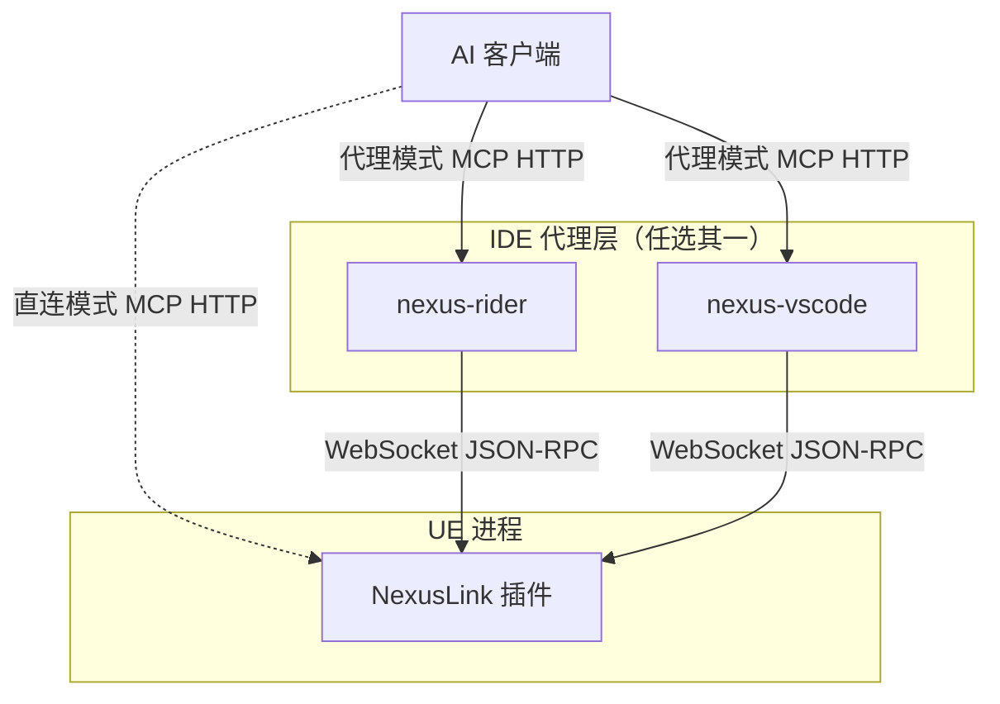
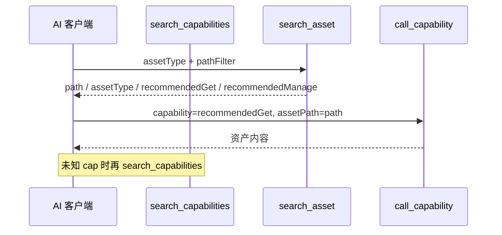

# NexusLink 使用指南

本文档面向最终用户，介绍如何安装、配置和使用 NexusLink 及 IDE 代理。

> NexusLink 支持三种接入方式：**直连 UE**、**通过 Rider 代理**、**通过 VSCode/Cursor 代理**。三种方式功能完全一致，选择与你使用的 IDE 匹配的方式即可。
>
> 完整参数与 Capability 列表见 [`tool-reference.md`](./tool-reference.md)；架构与注册机制见 [`architecture.md`](./architecture.md)。

---

## 1. 整体架构



- **实线路径（代理模式，推荐）**：AI 客户端 → IDE 代理（Rider 或 VSCode 二选一）→ UE 插件，代理层负责自动发现/切换 UE 实例
- **虚线路径（直连模式）**：AI 客户端 → UE 插件，跳过 IDE，适合不用 JetBrains/VSCode 的场景
- **AI 客户端**：Cursor / CodeBuddy / Windsurf 等支持 MCP 的工具
- **NexusLink**：作为 UE 插件运行在引擎进程内，直接调用引擎 API；同时对外暴露两条通道 —— **HTTP/MCP**（默认 45000，给 AI 直连）与 **WebSocket/JSON-RPC**（默认 55000，给 IDE 代理走长连接，省去 MCP 握手开销）

---

## 2. NexusLink（UE 插件）安装与配置

### 2.1 安装

1. 将 `NexusLink` 插件目录复制到 UE 项目的 `Plugins/Developer/` 目录下
2. 在 UE 编辑器中启用插件：**Edit → Plugins → Developer → NexusLink**
3. 重启编辑器

### 2.2 启用 MCP 服务器（必做）

MCP HTTP/WebSocket **默认不启动**，需在设置中手动开启：

1. 打开 **Edit → Editor Preferences → Plugins → NexusLink**
2. 在 **服务器** 分类下勾选 **启用 MCP 服务器**
3. 保存后**即时生效**，无需重启编辑器；取消勾选会立即停止 HTTP/WebSocket 并注销实例

> 代理模式（Rider / VSCode）与直连模式均依赖 UE 侧服务已开启；未勾选时 IDE 扫描不到实例、`GET /status` 无响应。

### 2.3 确认运行状态

勾选 **启用 MCP 服务器** 后：
- **Level Editor 工具栏**出现状态组件，显示当前 MCP 端口号，Hover 查看完整端口信息
- **编辑器视口右侧**覆盖层显示 MCP/WS 端口号（可在设置中关闭）
- 输出日志中可看到 `NexusLink 服务器已启动` 或 `MCP 服务器未启用，可在 Editor Preferences → Plugins → NexusLink 中开启`

### 2.4 端口说明

- 默认 MCP HTTP 端口：`45000`，WebSocket 端口：`55000`（独立端口段）
- 端口冲突时自动切换到下一个可用端口
- 设置面板（**Edit → Editor Preferences → Plugins → NexusLink**）只读显示实际运行端口
- 可在设置中开关"在状态栏显示端口号"

### 2.5 AI 反馈闭环

NexusLink 内置端到端的 AI 使用反馈系统，**所有数据只落本地 `<ProjectRoot>/.nexus-feedback/`，零网络外发**。

- **自动埋点**：`search_capabilities` / `call_capability` 对以下信号自动落盘（30 秒内相同事件节流）：
  - `search_zero` — `search_capabilities` 无命中
  - `search_overflow` — `search_capabilities` 命中过多
  - `call_unknown` — `call_capability` 找不到 capability（含误把元工具当 capability 调用）；或 AI 直接把 capability 名当独立 MCP 工具 `tools/call`（SearchMode 下应改用 `call_capability`，MultiTool 下则是拼错/幻觉的工具名）
  - `call_arg_invalid` — 参数校验失败（必填缺失、schema 不符、`search_asset` 过宽等）
  - `call_disabled` — capability 被禁用；或直接 `tools/call` 一个已禁用的 capability（MultiTool 模式）
  - `call_fatal` — capability 执行时致命错误
  - `redundant_call` — 已对同一资产发过 `sections=["all"]` 后又发子 section
  - `slow_call` — 执行耗时超过 `SlowCallThresholdMs` 阈值
- **代理层埋点**（IDE/Desktop 代理经 `nexus/proxy_feedback` 上报，不经过任何 MCP 工具）：AI 调用还没到达 UE 就在中转层失败时，也会记录以下信号（同样 30 秒节流，字段含 `proxy: vscode|rider|desktop`）：
  - `proxy_timeout` — 代理转发 `tools/call` 后 UE 未在时限内响应
  - `proxy_disconnect` — 代理转发时 WebSocket 未连接/已断开
  - `proxy_connect_fail` — 代理 `connect_unreal_instance` 连接失败
  - 旧版代理（未实现该上报）或旧版 NexusLink（未实现该方法）均静默降级，不影响正常使用
- **手动上报**：AI 遇到无法自解决的痛点时调用 `submit_feedback` 显式记录
- **导出**：设置面板「**导出 Markdown**」按钮生成聚合报告落盘到 `.nexus-feedback/report_<ts>.md`（含慢调用 Top 10、错误指纹 Top 5 等），并归档清空 `feedback.jsonl`
- **GitHub Issue**：设置面板「**创建 GitHub Issue**」读取 `feedback.jsonl` 生成标题/正文并在浏览器打开预填页面（可配置 `FeedbackIssueRepo`，默认 `bytepine/NexusLink`）

完整工具 schema 见 [`tool-reference.md §submit_feedback`](./tool-reference.md#submit_feedback)。

#### 2.5.1 设置面板

入口：`Edit → Editor Preferences → Plugins → NexusLink`。

| 设置 | 说明 |
|------|------|
| 插件信息 | 显示当前版本；**检查更新**按钮；**启动时自动检查更新**（默认开） |
| 启用 MCP 服务器 | 总开关，**默认关闭**；勾选后启动 HTTP/WebSocket 并注册实例供 IDE 发现，可随时切换无需重启 |
| 工具列表模式 | **SearchMode**（默认，3 个元工具）或 **MultiTool**（各 Capability 独立 Tool） |
| Capabilities | 按分类 / 单条启用或禁用（影响 `tools/list` 与 `search_capabilities` 命中） |
| 启用反馈采集 | 总开关；取消勾选后 auto/manual 都丢弃 |
| Feedback Issue 仓库 | GitHub `owner/repo` 或 URL，供「创建 GitHub Issue」预填 |
| 搜索过载阈值 / 最大搜索结果数 | 控制 `search_overflow` 与返回条数上限 |
| 慢调用阈值 (ms) | 超过则记 `slow_call` |
| 响应默认值压缩 | 全工具 JSON 响应自动抽取重复字段到 `*_defaults` |

控制台行按钮：**打开目录** / **导出 Markdown**（生成报告并归档）/ **创建 GitHub Issue**。

---

### 2.6 直连 UE（不使用 IDE 代理）

先完成 [§2.2 启用 MCP 服务器](#22-启用-mcp-服务器必做)，再在 AI 客户端的 MCP 配置中直接连接 UE 插件：

**Cursor**（`~/.cursor/mcp.json`）：
```json
{
  "mcpServers": {
    "nexus-link": {
      "url": "http://127.0.0.1:45000/stream"
    }
  }
}
```

**CodeBuddy / Windsurf**（Streamable HTTP）：
```json
"nexus-link": {
  "url": "http://127.0.0.1:45000/stream",
  "transportType": "streamable-http"
}
```

> 如果端口发生自动切换，请以 UE 编辑器工具栏/设置面板中显示的实际端口为准。

### 2.7 工具模型与暴露模式

NexusLink 将能力分为两层：

- **MCP 元工具（3 个）**：`search_capabilities`、`call_capability`、`submit_feedback`。
- **Capability（109 个，随插件条件略减）**：原子工作单元。`WITH_GAS=0` 时不注册 10 个 GAS 相关 cap；`WITH_NIAGARA=0` 时再减 1；`WITH_STATETREE=0` / `WITH_MVVM=0`（UE 5.5 以下恒为 0）各再减 1。完整清单见 [`tool-reference.md`](./tool-reference.md)。

**tools/list 暴露模式**（`Edit → Editor Preferences → Plugins → NexusLink → 工具列表模式`）：

| 模式 | tools/list 内容 | 说明 |
|------|----------------|------|
| **SearchMode**（默认） | 仅 3 个元工具 | AI 用 `search_capabilities` 发现能力，再用 `call_capability` 执行；**不要**把元工具名当作 `capability` 传入 |
| **MultiTool** | `submit_feedback` + 各已启用 Capability（各为独立 MCP Tool） | **无** `search_capabilities` / `call_capability`；直接 `tools/call` 对应 Tool 名 |

**AI 引导（两层分工）**：

| 层 | 来源 | 作用 |
|----|------|------|
| **MCP 握手** | UE 内 `ProxyConfig.json` + `InitializeInstructions.*.md` | Capability 路由表、元工具约束、触发关键词（代理连接 UE 后自动注入） |
| **IDE Rule（可选）** | 插件 `Resources/AIRules.mdc` → 复制到项目 `.cursor/rules/` | 强化四步流程、优先用 `search_asset` 的 `recommendedGet`/`recommendedManage`、禁止猜 path/cap 名、填写项目 `pathFilter` 前缀 |

- 修改 Capability 路由 / 元工具行为：**只改 UE 插件**内 `InitializeInstructions` / `ProxyConfig`。
- 减少 AI 用业务词搜工具、跳过 `search_asset`、猜 `get_asset_*` 名等问题：在游戏项目挂载 **AIRules**（见下文 §2.8）。
- 代理（Rider / VSCode）连接 UE 后缓存握手内容；断开时清空，重连后自动刷新。

**典型调用流程（SearchMode）**：



**资产读写约定**：`search_asset` 返回顶层 `assets`（无 `results[{assets}]` 信封）；指定具体 `assetType` 时顶层附 `recommendedGet`/`recommendedManage`，`assetType=all` 时推荐在每条上。后续调用优先用推荐名 + `assets[].path`。

**单条结果形状**：Capability `Entries` 仅 1 条时字段在顶层（无 `results[{...}]` 信封）；多条仍为 `results[]`。`call_capability` 的批量 `calls[]` 外层协议不变。

**身份字段**：响应统一用 `path`（入参仍为 `assetPath`）。`get_`/`manage_` 在单路径调用且回显与入参等价时省略 `path`。

**批量调用**：`call_capability` 支持 `calls=[{capability, arguments?}, ...]`，按顺序执行，单条失败不中断其余条目。

**失败时看 `errorKind`**（SearchMode / MultiTool 均适用）：`not_found`（未注册）、`disabled`（设置中已禁用）、`disabled_only`（模糊搜索仅命中已禁用项）、`query_too_broad`（`search_capabilities` 单用过宽词，见 `suggestedQueries`）。旧 Capability 名会自动映射到新规范名（如 `create_blackboard` → `create_asset_blackboard`）。

**编辑器只读示例（SearchMode）**：`get_editor_context`（选中 Actor/资产、Content Browser 路径）、`search_console_variables`（搜 CVar 名）、`capture_viewport`（含 `editor_desktop`）、`get_gameplay_tags`（`sections` 含 `referencers`，需 `tag`）。

### 2.8 挂载 AIRules（IDE 侧工作流 Rule）

插件提供 [`AIRules.mdc`](../Resources/AIRules.mdc)：**不**通过 MCP 注入，需手动复制到**游戏项目** IDE Rules，与握手 Instructions 互补。

**适用场景**：反馈中出现 `search_zero`（用业务词搜 capability）、缺 `assetPath`、`search_capabilities` 误包进 `call_capability` 等流程问题。

**步骤（Cursor）**：

1. 复制  
   `Resources/AIRules.mdc`  
   → 游戏项目 `.cursor/rules/nexuslink-workflow.mdc`
2. 编辑副本 **§4 项目定制**：填写默认 `pathFilter` 前缀（如 `/Game/YourFeature/`）、可选知识库 MCP 名
3. 确认 Cursor Rules 已启用（模板默认 `alwaysApply: false`，由 Agent 按 description 拉取；也可改为 `true` 强制每回合生效）
4. 插件升级后 diff 插件内 `AIRules.mdc`，将 §1–§3 通用段合并进项目副本

**步骤（Knot / 其他）**：将 §1–§3 粘贴为项目 Rules；§4 填项目信息。玩法文档走知识库 MCP，UE 资产走 NexusLink — 在 §4 写清分工。

**勿在 AIRules 中**：重复 Capability 路由表（以 `InitializeInstructions.SearchMode.md` 为准）；登记项目独有业务名到 NexusLink 插件源码。

---

## 3. NexusRider（Rider 代理）安装与配置

### 3.1 安装

1. 从 [NexusRider Releases](https://github.com/bytepine/NexusRider/releases) 下载 `nexus-mcp-rider-<version>.zip`
2. Rider → **Settings → Plugins → ⚙ → Install Plugin from Disk** → 选择 zip
3. 重启 Rider，**打开一个项目**
4. 打开 **Settings → Tools → Nexus MCP**，勾选 **启用 Nexus MCP 服务器**（默认关闭；勾选后立即启动，默认端口 `6800`）

完整说明见 [NexusRider README](https://github.com/bytepine/NexusRider/blob/master/README.md)。

### 3.2 设置面板与配置项

打开 **Settings → Tools → Nexus MCP**：

| 配置项 | 默认值 | 说明 |
|--------|--------|------|
| 启用 Nexus MCP 服务器 | `false` | 总开关；勾选/取消后立即启停，无需重启 Rider |
| MCP 端口 | `6800` | AI 客户端连接端口；**修改后需重启 Rider** |
| 扫描端口范围 | `45000`–`45100` | UE 实例发现范围；修改后需重启 MCP 服务（关开总开关即可） |
| 扫描间隔 | `5` 秒 | 定时发现间隔；修改后同上 |

- 点击「**Streamable HTTP 配置**」或「**SSE 配置**」按钮，在预览框中生成 AI 客户端配置片段，可直接复制

### 3.3 状态栏

- Rider 底部状态栏显示 UE 连接状态：
  - **⬢ 项目名** — 已连接到 UE 实例
  - **⬡ Nexus** — 未连接
- 点击状态栏组件弹出实例列表，可一键切换连接目标（无命令面板刷新命令，依赖定时扫描与断连后立即重扫）

### 3.4 UE 实例发现

插件自动发现 UE 实例（默认每 5 秒刷新，可在设置中修改）：

- **端口扫描**：20 线程并发扫描配置的端口范围，通过 `GET /status` 探测活跃的 NexusLink 实例
- **前提**：UE 编辑器须在 **Editor Preferences → Plugins → NexusLink** 中勾选 **启用 MCP 服务器**（默认关闭），否则扫描结果为空

唯一实例时自动连接；多实例时优先连 Editor 实例，在状态栏选择可切换目标。断线期间代理保留工具列表缓存，重连成功后刷新清单。

### 3.5 连接 AI 客户端

**Cursor**（`~/.cursor/mcp.json`）：
```json
{
  "mcpServers": {
    "nexus-rider": {
      "url": "http://127.0.0.1:6800/stream"
    }
  }
}
```

**CodeBuddy / Windsurf**（Streamable HTTP）：
```json
"Nexus": {
  "url": "http://127.0.0.1:6800/stream",
  "transportType": "streamable-http",
  "description": "NexusLink MCP Server for Unreal Engine",
  "disabled": false
}
```

---

## 4. NexusVSCode（VSCode / Cursor 代理）安装与配置

### 4.1 安装

1. 从 [NexusVSCode Releases](https://github.com/bytepine/NexusVSCode/releases) 下载 `nexus-mcp-vscode-<version>.vsix`
2. VSCode / Cursor → **Extensions: Install from VSIX...**
3. 重载窗口后，在 **Settings** 中将 `nexusMcp.enabled` 设为 `true`（默认关闭）

完整说明见 [NexusVSCode README](https://github.com/bytepine/NexusVSCode/blob/master/README.md)。

### 4.2 UE 实例发现

扩展并发扫描端口范围，通过 `GET /status` 探测活跃的 NexusLink 实例（每 `scanIntervalSeconds` 秒定时刷新，断连后立即重扫）。

**前提**：UE 侧须在 **Editor Preferences → Plugins → NexusLink** 中勾选 **启用 MCP 服务器**（默认关闭），否则状态栏长期显示「未连接」。

### 4.3 配置项

| 配置键 | 默认值 | 说明 |
|--------|--------|------|
| `nexusMcp.enabled` | `false` | 总开关；改为 `true` 后 MCP 代理才监听 |
| `nexusMcp.httpPort` | `6900` | HTTP MCP 服务端口 |
| `nexusMcp.scanPortStart` | `45000` | UE 扫描起始端口 |
| `nexusMcp.scanPortEnd` | `45100` | UE 扫描结束端口 |
| `nexusMcp.scanIntervalSeconds` | `5` | 自动扫描间隔（秒） |

### 4.4 状态栏与命令面板

- 状态栏显示 UE 连接状态，点击切换实例
- 命令面板（`Ctrl+Shift+P`）：
  - `Nexus MCP: Refresh Instances` — 手动刷新 UE 实例列表
  - `Nexus MCP: Select Instance` — 选择要连接的 UE 实例
  - `Nexus MCP: Disconnect` — 断开当前连接
  - `Nexus MCP: Copy MCP Config` — 复制 AI 客户端配置到剪贴板

### 4.5 连接 AI 客户端

**Cursor**（`~/.cursor/mcp.json`）：
```json
{
  "mcpServers": {
    "nexus-vscode": {
      "url": "http://127.0.0.1:6900/stream"
    }
  }
}
```

**CodeBuddy / Windsurf**（Streamable HTTP）：
```json
"Nexus": {
  "url": "http://127.0.0.1:6900/stream",
  "transportType": "streamable-http",
  "description": "NexusLink MCP Server for Unreal Engine",
  "disabled": false
}
```

---

## 5. 常见问题

### AI 客户端显示"MCP 初始化超时"

- 确认 UE 编辑器已启动且 NexusLink 插件已加载
- 检查 AI 客户端配置中的端口号是否与实际运行端口一致
- 使用代理模式（Rider/VSCode 插件）时，确认 IDE 状态栏显示已连接

### 多个 AI 客户端同时使用

- 三个插件（UE/Rider/VSCode）均支持 per-session 会话隔离（`Mcp-Session-Id` header）
- 多个 AI 客户端可同时连接同一个 MCP 服务器，互不干扰

### 多个 UE 实例同时运行

- 每个 UE 实例自动分配不同端口，不会冲突
- 代理插件（Rider/VSCode）自动发现所有实例，在状态栏选择目标即可
- 直连模式需手动指定目标实例的端口

### 修改了属性但 UE 中没有生效

- `set_*_property` 修改的是内存中的值，需调用 `save_asset` 持久化到磁盘
- 蓝图结构（变量/组件/图表）与 Widget 设计时修改由各 `manage_*` / `set_property` 路径在批量结束后触发重编译；落盘仍用 `save_asset`
