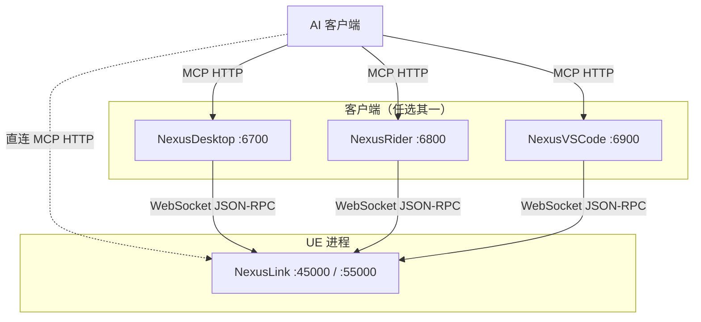

# NexusLink 使用指南

面向最终用户：安装 UE 插件、选客户端、打开对应层开关、配置鉴权。Capability 参数见 [`tool-reference.zh.md`](./tool-reference.zh.md)（[English](./tool-reference.md)）；架构见 [`architecture.md`](./architecture.md)。

---

## 0. 从 1.x 升级到 2.0

2.0 有两处不向下兼容，升级前先看这里。

**① 默认开启鉴权 —— 四端须同批升级。** 1.x 的中转不会发 WS 首帧 `auth`，连不上开着鉴权的 2.0 UE。UE 插件与 NexusDesktop / NexusRider / NexusVSCode 请一起升到 2.x；只能升一半时，临时在 UE 关掉 **MCP 鉴权** 顶一下，但别停在这个状态。

**② MCP/AI 可见文案全部英文化。** Capability 描述、报错文案、AIRules 等改为英文（源码注释、设置面板、UE_LOG 仍中文）。如果你有依赖中文报错串的自建脚本/提示词，需要同步改。

其他升级注意：

- **直连 UE 的 AI 配置须加 Bearer**：从 UE 设置面板复制 **MCP 鉴权 Token**（详见 [§1.1](#11-鉴权)）。经中转且中转在同机时无需配置。
- **额外鉴权 Token 从「单行逗号分隔」改为逐条列表**：升级后自动拆分；若一条合法 token 都解析不出会保留原值并在日志告警，不会静默清空。
- **危险 Capability 默认禁用**：`exec_command` / `eval_runtime_lua` / `dofile_runtime_lua` 升级时一次性写入禁用列表，需要时在设置面板重新勾选。
- **用过 2.0.0-beta 的工程**：beta 曾往 `Engine.ini` 写全局键 `[HTTPServer.Listeners] DefaultBindAddress`。正式版只写本端口的 `ListenerOverrides`，检测到该残留键会在启动日志告警，可手动删除。

---

## 1. 选端与开关


```mermaid
flowchart TB
    AI[AI 客户端]

    subgraph Clients["客户端（任选其一）"]
        Desktop["NexusDesktop :6700"]
        Rider["NexusRider :6800"]
        VSCode["NexusVSCode :6900"]
    end

    subgraph UE["UE 进程"]
        Unreal["NexusLink :45000 / :55000"]
    end

    AI -->|MCP HTTP| Desktop
    AI -->|MCP HTTP| Rider
    AI -->|MCP HTTP| VSCode
    AI -.->|直连 MCP HTTP| Unreal
    Desktop -->|WebSocket JSON-RPC| Unreal
    Rider -->|WebSocket JSON-RPC| Unreal
    VSCode -->|WebSocket JSON-RPC| Unreal
```

| 接入 | 端点 | 适用 |
|------|------|------|
| **[NexusDesktop](https://github.com/bytepine/NexusDesktop)** | `http://127.0.0.1:6700/stream` | 独立托盘程序，无需 IDE 插件 |
| **[NexusRider](https://github.com/bytepine/NexusRider)** | `http://127.0.0.1:6800/stream` | JetBrains Rider |
| **[NexusVSCode](https://github.com/bytepine/NexusVSCode)** | `http://127.0.0.1:6900/stream` | VSCode / Cursor / CodeBuddy / Windsurf |
| **直连 UE** | `http://127.0.0.1:45000/stream` | 不用代理；须自行指定 UE 端口 |

能力由 UE 侧 NexusLink 提供；Desktop / Rider / VSCode 负责发现、转发，以及 [代理会话层](./proxy-session.md)（TTL 缓存、编辑器不可达时的读快照、写门控、Pause）。直连 UE 没有会话层。

| 方式 | 须开启 |
|------|--------|
| 直连 UE | **一层**：UE **启用 MCP 服务器** + AI 配 `:45000` |
| NexusDesktop | **两层**：UE **启用 MCP 服务器** + 托盘 **启用中转服务器**（新安装默认关） + AI 配 `:6700` |
| Rider / VSCode | **三层**：UE **启用 MCP 服务器** + IDE 代理 **启用** + AI 配 `:6800` / `:6900` |

任一层关闭则不可用。端口冲突时各端会自动顺延，以界面显示的实际端口为准。

本机只开一个代理（Desktop `:6700` / Rider `:6800` / VSCode `:6900` 勿叠开）；叠开会重复扫描并各自连同一 UE。

默认只绑 loopback。带 `Origin` 的浏览器请求会被拒绝。`exec_command` / `eval_runtime_lua` / `dofile_runtime_lua` 默认禁用。

### 1.1 鉴权

四端共用本机一份 token 文件（重启后不变）：

| 系统 | 路径 |
|------|------|
| Windows | `%LOCALAPPDATA%\NexusLink\mcp-auth-token` |
| macOS | `~/Library/Application Support/NexusLink/mcp-auth-token` |
| Linux | `~/.config/NexusLink/mcp-auth-token` |

`GET /status` 仅探活，**不含 token**。本机代理连本机 UE 会自动读该文件（及 `{Temp}/NexusLink/{PID}.json`），**无需**再配 remoteUnreal。

| 开关 | 位置 | 默认 | 关闭后 |
|------|------|------|--------|
| **MCP 鉴权** | UE 编辑器偏好 | 开 | HTTP/WS 不校验；`/status.authRequired=false`（同旧版插件） |
| **启用 MCP 鉴权** | Desktop / Rider / VSCode | 开 | AI 连该中转无需 Bearer（同旧版中转）；连 UE 仍看对方 `authRequired` |

两端开关独立：

| 中转 \ UE | UE 鉴权开 | UE 鉴权关 / 旧版 UE |
|-----------|-----------|---------------------|
| **中转鉴权开** | AI 须 Bearer；中转对 UE 发 WS auth | AI 须 Bearer；跳过 WS auth |
| **中转鉴权关** | AI 无需 Bearer；中转仍对 UE 发 WS auth | 两边都不鉴权 |
| **旧版（1.x）中转** | **连不上**：1.x 不发 WS 首帧 auth → 升级中转，或临时关 UE 鉴权 | 两边都不鉴权 |

多 token（连多台机器）：

- UE / Desktop / Rider 的 **额外鉴权 Token**：设置里逐条添加（VSCode 为 `extraAuthTokens` 数组）；本机 token 始终有效
- AI `mcp.json` 可写 `"Authorization": "Bearer <tok1>, <tok2>"`，对端命中任一项即可
- 远程 UE：`host:mcpPort [token...]`，token 可省略并改用额外列表

### 1.2 跨机（显式 IP，不扫网段）

在**提供服务的那一端**复制跨机连接，选对网卡 IP，再到对端粘贴。复制出的 Bearer **只带本机 token**（不要把额外 token 打进 mcp.json）。

1. **UE**：勾选 **允许局域网绑定**（HTTP 绑 `0.0.0.0`），开系统防火墙入站；**不要**做公网端口映射。设置里选网卡 → **复制跨机连接**，得到 AI mcp.json、中转 `remoteUnreal` 一行、VSCode `remoteUnreal` 条目。未开 MCP 也可复制 token；端口未启动时暂用 `45000`，以标题栏实际端口为准。
2. **中转 → UE**：本机 UE 无需配置。把上一步的远程行粘进 `remoteUnreal`（token 可省略并改填 **额外鉴权 Token**）。只探这些地址的 `/status`。
3. **AI → 中转**：勾选 listenLan / 允许局域网接入，用命令/面板 **复制 MCP 客户端配置**（多网卡时先选 IP）。Bearer 用中转机本机 token。

局域网绑定且关闭鉴权时会弹出确认：同网段主机都能控制编辑器。

**WS 端口（`:55000`）的绑定地址受引擎版本限制**：UE 5.2+ 按「允许局域网绑定」绑 `127.0.0.1` 或 `0.0.0.0`；UE 4.26–5.1 的引擎接口不支持指定绑定地址，WS 一律绑全部网卡，只能靠首帧 auth 兜底 —— 这些版本上**不要关闭 MCP 鉴权**（关闭时启动日志会报 Error）。

```json
{
  "mcpServers": {
    "nexus-unreal": {
      "url": "http://192.168.1.20:6900/stream",
      "headers": { "Authorization": "Bearer <中转机本机 token>" }
    }
  }
}
```

VSCode 远程条目示例（也可从 UE「复制跨机连接」粘贴）：

```json
"nexusMcp.listenLan": true,
"nexusMcp.extraAuthTokens": ["<其他机器 token>"],
"nexusMcp.remoteUnreal": [
  { "host": "192.168.1.30", "mcpPort": 45000, "authToken": "<UE 本机 token>" }
]
```

Rider / Desktop 远程列表每行：`192.168.1.30:45000` 或 `192.168.1.30:45000 <token>`。

---

## 2. NexusLink（UE 插件）

### 2.1 安装

1. 从 [NexusLink Releases](https://github.com/bytepine/NexusLink/releases) 下载 `nexus-mcp-unreal-*.zip`，解压到项目 `Plugins/Developer/NexusLink`
2. **Edit → Plugins → Developer → NexusLink** — 启用插件
3. 重启编辑器

主模块 `Type` 为 **UncookedOnly**（Editor 二进制含 `-server`/`-game` 会加载；cooked Game/Server 不编）——**MCP 跑在 Editor / PIE / editor-hosted `-server`**。

### 2.2 启用 MCP 服务器（必做）

MCP HTTP/WebSocket **默认不启动**，任选以下方式：

**方式 A — 设置面板（持久）**

1. **Edit → Editor Preferences → Plugins → NexusLink**
2. 在 **服务器** 分类下勾选 **启用 MCP 服务器**
3. 保存后**即时生效**；取消勾选立即停止 HTTP/WebSocket 并注销实例

**方式 B — 命令行（仅本进程，不写盘）**

```bat
UE4Editor.exe YourProject.uproject -EnableNexusMcp
```

**方式 C — 控制台（仅本进程，不写盘）**

```
NexusLink.EnableMcp 1   ; 开启
NexusLink.EnableMcp 0   ; 关闭
NexusLink.EnableMcp     ; 查看 on/off
```

Preferences 与 `-EnableNexusMcp` / 控制台为 **OR**。CLI 不会改写 `bEnableMcpServer`。

### 2.3 确认运行状态

- **编辑器标题栏右侧**（与 FPS/内存/对象同一组）显示 MCP/WS 端口号（默认开启；关闭 MCP 后不显示）
- 输出日志可见 `NexusLink 服务器已启动`，或未启用时的提示

### 2.4 端口

- 默认 MCP HTTP `45000`，WebSocket `55000`
- 冲突时自动切到下一可用端口；设置面板只读显示实际端口
- 可开关「在状态栏显示端口号」（**默认开启**）

### 2.5 设置面板与反馈

入口：`Edit → Editor Preferences → Plugins → NexusLink`。反馈数据只落本地 `<ProjectRoot>/.nexus-feedback/`，零网络外发。

| 设置 | 说明 |
|------|------|
| 插件信息 | 当前版本；**检查更新**；**启动时自动检查更新**（默认开） |
| 启用 MCP 服务器 | 总开关，**默认关闭** |
| MCP 鉴权 | 默认开；关闭后 HTTP/WS 不校验 token（同旧版） |
| MCP 鉴权 Token | 本机唯一；旁有「复制」仅写入 token，「复制跨机连接」可选网卡并带出 mcp.json / remoteUnreal；未开 MCP 也可复制 |
| 额外鉴权 Token | 其他机器的 token，点 + 逐条添加；本机 token 无需再填 |
| 工具列表模式 | **SearchMode**（默认，3 个元工具）或 **MultiTool**（各 Capability 独立 Tool） |
| Capabilities | 按目录折叠，可按组或单条启用/禁用 |
| 启用反馈采集 | 总开关；取消后 auto/manual 都丢弃 |
| Feedback Issue 仓库 | GitHub `owner/repo`，供「创建 GitHub Issue」预填 |
| 搜索过载阈值 / 最大搜索结果数 | 控制 `search_overflow` 与返回条数上限 |
| 慢调用阈值 (ms) | 超过则记 `slow_call` |
| 响应默认值压缩 | JSON 响应抽取重复字段到 `*_defaults`（缺省即默认） |
| 自动卸载读取引入的包 | 批量只读达阈值后整批卸载（默认开） |
| 卸载阈值（包数量） / 内存高水位（MB） | 默认 16 包 / 1024 MB |

控制台行按钮：**打开目录** / **导出 Markdown** / **创建 GitHub Issue**。批量读取后若需保留包，对 `call_capability` 传 `keepLoaded=true`；立即释放用 `unload_asset`。

自动埋点与 `submit_feedback` 的 schema 见 [`tool-reference.zh.md`](./tool-reference.zh.md#submit_feedback)。

### 2.6 直连 UE

先完成 [§2.2](#22-启用-mcp-服务器必做)，再在 AI 客户端配置：

**Cursor**（`~/.cursor/mcp.json`）：

```json
{
  "mcpServers": {
    "nexus-link": {
      "url": "http://127.0.0.1:45000/stream",
      "headers": {
        "Authorization": "Bearer <token>"
      }
    }
  }
}
```

Token 从设置面板 **MCP 鉴权 Token** 旁的「复制」取得。可逗号分隔多个；也可把对方 token 填进 **额外鉴权 Token**。不要从 `GET /status` 猜。完整规则见 [§1.1](#11-鉴权)。

**CodeBuddy / Windsurf**：

```json
"nexus-link": {
  "url": "http://127.0.0.1:45000/stream",
  "transportType": "streamable-http",
  "headers": {
    "Authorization": "Bearer <token>"
  }
}
```

端口若自动切换，以编辑器标题栏/设置面板为准。

### 2.7 工具模型（SearchMode）

- **元工具（3 个）**：`search_capabilities`、`call_capability`、`submit_feedback`。不要把元工具名当作 `capability` 传入。
- **Capability**：原子工作单元，随宿主插件/引擎版本裁剪。完整清单见 [`tool-reference.zh.md`](./tool-reference.zh.md)。
- **SearchMode**（默认）：`tools/list` 仅 3 个元工具；先 `search_capabilities` 再 `call_capability`。日常与长会话推荐。
- **MultiTool**：各已启用 Capability 为独立 Tool；仅当客户端必须一次枚举全 Tool 时使用。对比见 [architecture §暴露模式](./architecture.md#暴露模式toolslistmode)。

读资产：`search_asset`（`assetType` + `pathFilter`）→ 用返回的 `assets[].path` 与 `recommendedGet` / `recommendedManage`。参数契约与 Breaking 键以 [`InitializeInstructions.SearchMode.md`](../Resources/InitializeInstructions.SearchMode.md) 与 [`CapabilitySpec.md`](../Resources/CapabilitySpec.md) 为准。

### 2.8 挂载 AIRules

插件 [`AIRules.mdc`](../Resources/AIRules.mdc) **不**经 MCP 注入，需复制到游戏项目 IDE Rules，与握手 Instructions 互补。

1. 复制 `Resources/AIRules.mdc` → 游戏项目 `.cursor/rules/nexuslink-workflow.mdc`
2. 编辑副本的项目定制节：填写默认 `pathFilter` 前缀
3. 插件升级后 diff 插件内 `AIRules.mdc`，将通用段合并进项目副本

勿在 AIRules 中重复 Capability 路由表（以 `InitializeInstructions.SearchMode.md` 为准）。

---

## 3. NexusDesktop

独立托盘程序，**无需 IDE 插件**。默认 `:6700`。

1. 从 [NexusDesktop Releases](https://github.com/bytepine/NexusDesktop/releases) 下载：**Windows** `NexusDesktop-windows-amd64-v<版本>-setup.exe`，**macOS** `NexusDesktop-darwin-universal.dmg`。不要下载 `*-update.zip`（应用内更新包）
2. 安装并启动，程序进入系统托盘（macOS 为菜单栏，不出现在 Dock）
3. 托盘勾选 **启用中转服务器**
4. AI 客户端指向 `http://127.0.0.1:6700/stream`

安装范围、应用内更新、开机自启见 [NexusDesktop README](https://github.com/bytepine/NexusDesktop/blob/master/README.md)。

---

## 4. NexusRider

1. Rider **Settings → Plugins → Marketplace** 搜索 **Nexus MCP**（或从 [Releases](https://github.com/bytepine/NexusRider/releases) 装 zip）
2. **打开一个项目**（须 Open Project 后服务才监听）
3. **Settings → Tools → Nexus MCP** — 勾选 **启用 Nexus MCP 服务器**（默认 `:6800`）
4. AI 客户端指向 `http://127.0.0.1:6800/stream`

设置项、状态栏、多窗口端口顺延见 [NexusRider README](https://github.com/bytepine/NexusRider/blob/master/README.md)。

---

## 5. NexusVSCode

1. 在 VSCode / Cursor / CodeBuddy / Windsurf 扩展面板搜索 **Nexus MCP** 并安装（[Open VSX](https://open-vsx.org/extension/byteyang/nexus-mcp-vscode) · [VS Marketplace](https://marketplace.visualstudio.com/items?itemName=byteyang.nexus-mcp-vscode)）。或从 [Releases](https://github.com/bytepine/NexusVSCode/releases) 装 `.vsix`
2. **Settings** → `nexusMcp.enabled` = `true`（默认 `:6900`）
3. AI 客户端指向 `http://127.0.0.1:6900/stream`，或命令面板 **Nexus MCP: 复制 MCP 客户端配置**

配置键与命令面板见 [NexusVSCode README](https://github.com/bytepine/NexusVSCode/blob/master/README.md)。

---

## 6. 常见问题

### AI 客户端「MCP 初始化超时」

- UE 已启动且 NexusLink 已加载，并勾选 **启用 MCP 服务器**
- 代理模式下 Desktop 托盘已启用中转 / Rider 或 VSCode 总开关已开，且状态显示已连 UE
- AI 配置的端口与界面显示的实际端口一致
- 鉴权开启时 `mcp.json` 须带 `Authorization: Bearer`，且 token 是对端接受的那份（见 [§1.1](#11-鉴权)）

### 连接被拒（401 / `unauthorized`）

按报错方向排查：

| 现象 | 原因 | 处理 |
|------|------|------|
| AI → 中转/UE 报 401 | `mcp.json` 没带 Bearer，或 token 不是对端接受的那份 | 从对端设置面板复制 token（UE 是 **MCP 鉴权 Token**）；跨机用对端本机 token |
| 中转日志显示 WS auth 失败 | 中转拿不到 UE 的 token（多为跨机、或用了旧版中转） | 跨机在中转填 `remoteUnreal` 的 token，或把 UE token 加到中转 **额外鉴权 Token**；旧版中转须升级 |
| 填了额外 Token 仍被拒 | token 不合法（须 32–128 位十六进制），或粘贴了别的字段 | 逐条重新添加；UE 日志会打印「没有合法条目」告警 |

同机四端共用一份 token 文件，正常无需任何配置；出现 401 多半是跨机或版本不齐。

### 多个 AI 客户端同时使用

UE 与各客户端均支持 per-session 隔离（`Mcp-Session-Id`）。可同时连同一 MCP 服务器。

### 多个 UE 实例同时运行

每个 UE 实例自动分配不同端口。代理可发现全部实例并在托盘/状态栏切换。直连须手动指定端口。

### 走代理时编辑器正在编译 / 重启

代理会尽量返回上次读快照（结果带 `_proxy.degraded: "unavailable"`）。**不要**循环调用 `list_unreal_instances`。写操作仍失败。契约见 [proxy-session.md](./proxy-session.md)。直连 `:45000` 没有该层。

### 代理弹出写操作确认

Desktop / Rider / VSCode 默认对删除、重命名、停止 PIE 等破坏性调用弹确认（`writeGate=destructive`）。可改为 `off` 或 `all`。Pause 会让后续远端调用在代理排队。

### 修改了属性但 UE 中没有生效 / 磁盘未变化

`set_*_property` 改的是内存；须 `save_asset` 或 manage 传 `saveToDisk=true`。BP/ABP/WBP 可再传 `compile=true`。
