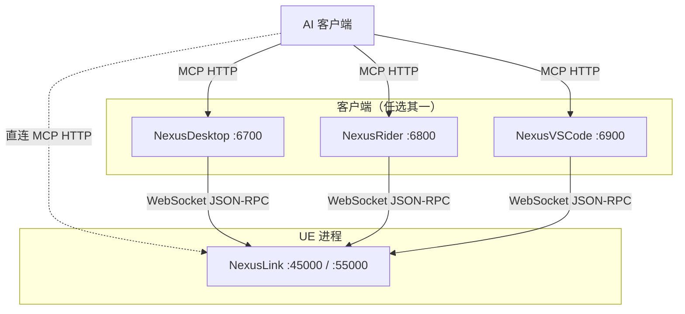

# NexusLink 使用指南

面向最终用户：安装 UE 插件、选客户端、打开对应层开关。Capability 参数见 [`tool-reference.md`](./tool-reference.md)；架构见 [`architecture.md`](./architecture.md)。

---

## 1. 选端与开关


```mermaid
flowchart TB
    AI[AI 客户端]

    subgraph Clients["客户端（任选其一）"]
        Desktop["NexusDesktop :6700"]
        Rider["NexusRider :6800"]
        VSCode["NexusVSCode :6900"]
    end

    subgraph UE["UE 进程"]
        Unreal["NexusLink :45000 / :55000"]
    end

    AI -->|MCP HTTP| Desktop
    AI -->|MCP HTTP| Rider
    AI -->|MCP HTTP| VSCode
    AI -.->|直连 MCP HTTP| Unreal
    Desktop -->|WebSocket JSON-RPC| Unreal
    Rider -->|WebSocket JSON-RPC| Unreal
    VSCode -->|WebSocket JSON-RPC| Unreal
```

| 接入 | 端点 | 适用 |
|------|------|------|
| **[NexusDesktop](https://github.com/bytepine/NexusDesktop)** | `http://127.0.0.1:6700/stream` | 独立托盘程序，无需 IDE 插件 |
| **[NexusRider](https://github.com/bytepine/NexusRider)** | `http://127.0.0.1:6800/stream` | JetBrains Rider |
| **[NexusVSCode](https://github.com/bytepine/NexusVSCode)** | `http://127.0.0.1:6900/stream` | VSCode / Cursor / CodeBuddy / Windsurf |
| **直连 UE** | `http://127.0.0.1:45000/stream` | 不用代理；须自行指定 UE 端口 |

能力由 UE 侧 NexusLink 提供；Desktop / Rider / VSCode 负责发现、转发，以及 [代理会话层](./proxy-session.md)（TTL 缓存、编辑器不可达时的读快照、写门控、Pause）。直连 UE 没有会话层。

| 方式 | 须开启 |
|------|--------|
| 直连 UE | **一层**：UE **启用 MCP 服务器** + AI 配 `:45000` |
| NexusDesktop | **两层**：UE **启用 MCP 服务器** + 托盘 **启用中转服务器** + AI 配 `:6700` |
| Rider / VSCode | **三层**：UE **启用 MCP 服务器** + IDE 代理 **启用** + AI 配 `:6800` / `:6900` |

任一层关闭则不可用。端口冲突时各端会自动顺延，以界面显示的实际端口为准。

---

## 2. NexusLink（UE 插件）

### 2.1 安装

1. 从 [NexusLink Releases](https://github.com/bytepine/NexusLink/releases) 下载 `nexus-mcp-unreal-*.zip`，解压到项目 `Plugins/Developer/NexusLink`
2. **Edit → Plugins → Developer → NexusLink** — 启用插件
3. 重启编辑器

主模块 `Type` 为 **Runtime**（Game/Server 可链接）；`Startup`/`Shutdown` 在 `!WITH_EDITOR` 时空返回——**MCP 仅 Editor / PIE 实际运行**。

### 2.2 启用 MCP 服务器（必做）

MCP HTTP/WebSocket **默认不启动**，任选以下方式：

**方式 A — 设置面板（持久）**

1. **Edit → Editor Preferences → Plugins → NexusLink**
2. 在 **服务器** 分类下勾选 **启用 MCP 服务器**
3. 保存后**即时生效**；取消勾选立即停止 HTTP/WebSocket 并注销实例

**方式 B — 命令行（仅本进程，不写盘）**

```bat
UE4Editor.exe YourProject.uproject -EnableNexusMcp
```

**方式 C — 控制台（仅本进程，不写盘）**

```
NexusLink.EnableMcp 1   ; 开启
NexusLink.EnableMcp 0   ; 关闭
NexusLink.EnableMcp     ; 查看 on/off
```

Preferences 与 `-EnableNexusMcp` / 控制台为 **OR**。CLI 不会改写 `bEnableMcpServer`。

### 2.3 确认运行状态

- **编辑器标题栏右侧**（与 FPS/内存/对象同一组）显示 MCP/WS 端口号（默认开启；关闭 MCP 后不显示）
- 输出日志可见 `NexusLink 服务器已启动`，或未启用时的提示

### 2.4 端口

- 默认 MCP HTTP `45000`，WebSocket `55000`
- 冲突时自动切到下一可用端口；设置面板只读显示实际端口
- 可开关「在状态栏显示端口号」（**默认开启**）

### 2.5 设置面板与反馈

入口：`Edit → Editor Preferences → Plugins → NexusLink`。反馈数据只落本地 `<ProjectRoot>/.nexus-feedback/`，零网络外发。

| 设置 | 说明 |
|------|------|
| 插件信息 | 当前版本；**检查更新**；**启动时自动检查更新**（默认开） |
| 启用 MCP 服务器 | 总开关，**默认关闭** |
| 工具列表模式 | **SearchMode**（默认，3 个元工具）或 **MultiTool**（各 Capability 独立 Tool） |
| Capabilities | 按目录折叠，可按组或单条启用/禁用 |
| 启用反馈采集 | 总开关；取消后 auto/manual 都丢弃 |
| Feedback Issue 仓库 | GitHub `owner/repo`，供「创建 GitHub Issue」预填 |
| 搜索过载阈值 / 最大搜索结果数 | 控制 `search_overflow` 与返回条数上限 |
| 慢调用阈值 (ms) | 超过则记 `slow_call` |
| 响应默认值压缩 | JSON 响应抽取重复字段到 `*_defaults`（缺省即默认） |
| 自动卸载读取引入的包 | 批量只读达阈值后整批卸载（默认开） |
| 卸载阈值（包数量） / 内存高水位（MB） | 默认 16 包 / 1024 MB |

控制台行按钮：**打开目录** / **导出 Markdown** / **创建 GitHub Issue**。批量读取后若需保留包，对 `call_capability` 传 `keepLoaded=true`；立即释放用 `unload_asset`。

自动埋点与 `submit_feedback` 的 schema 见 [`tool-reference.md`](./tool-reference.md#submit_feedback)。

### 2.6 直连 UE

先完成 [§2.2](#22-启用-mcp-服务器必做)，再在 AI 客户端配置：

**Cursor**（`~/.cursor/mcp.json`）：

```json
{
  "mcpServers": {
    "nexus-link": {
      "url": "http://127.0.0.1:45000/stream"
    }
  }
}
```

**CodeBuddy / Windsurf**：

```json
"nexus-link": {
  "url": "http://127.0.0.1:45000/stream",
  "transportType": "streamable-http"
}
```

端口若自动切换，以编辑器标题栏/设置面板为准。

### 2.7 工具模型（SearchMode）

- **元工具（3 个）**：`search_capabilities`、`call_capability`、`submit_feedback`。不要把元工具名当作 `capability` 传入。
- **Capability**：原子工作单元，随宿主插件/引擎版本裁剪。完整清单见 [`tool-reference.md`](./tool-reference.md)。
- **SearchMode**（默认）：`tools/list` 仅 3 个元工具；先 `search_capabilities` 再 `call_capability`。日常与长会话推荐。
- **MultiTool**：各已启用 Capability 为独立 Tool；仅当客户端必须一次枚举全 Tool 时使用。对比见 [architecture §暴露模式](./architecture.md#暴露模式toolslistmode)。

读资产：`search_asset`（`assetType` + `pathFilter`）→ 用返回的 `assets[].path` 与 `recommendedGet` / `recommendedManage`。参数契约与 Breaking 键以 [`InitializeInstructions.SearchMode.md`](../Resources/InitializeInstructions.SearchMode.md) 与 [`CapabilitySpec.md`](../Resources/CapabilitySpec.md) 为准。

### 2.8 挂载 AIRules

插件 [`AIRules.mdc`](../Resources/AIRules.mdc) **不**经 MCP 注入，需复制到游戏项目 IDE Rules，与握手 Instructions 互补。

1. 复制 `Resources/AIRules.mdc` → 游戏项目 `.cursor/rules/nexuslink-workflow.mdc`
2. 编辑副本的项目定制节：填写默认 `pathFilter` 前缀
3. 插件升级后 diff 插件内 `AIRules.mdc`，将通用段合并进项目副本

勿在 AIRules 中重复 Capability 路由表（以 `InitializeInstructions.SearchMode.md` 为准）。

---

## 3. NexusDesktop

独立托盘程序，**无需 IDE 插件**。默认 `:6700`。

1. 从 [NexusDesktop Releases](https://github.com/bytepine/NexusDesktop/releases) 下载：**Windows** `NexusDesktop-windows-amd64-v<版本>-setup.exe`，**macOS** `NexusDesktop-darwin-universal.dmg`。不要下载 `*-update.zip`（应用内更新包）
2. 安装并启动，程序进入系统托盘（macOS 为菜单栏，不出现在 Dock）
3. 托盘勾选 **启用中转服务器**
4. AI 客户端指向 `http://127.0.0.1:6700/stream`

安装范围、应用内更新、开机自启见 [NexusDesktop README](https://github.com/bytepine/NexusDesktop/blob/master/README.md)。

---

## 4. NexusRider

1. Rider **Settings → Plugins → Marketplace** 搜索 **Nexus MCP**（或从 [Releases](https://github.com/bytepine/NexusRider/releases) 装 zip）
2. **打开一个项目**（须 Open Project 后服务才监听）
3. **Settings → Tools → Nexus MCP** — 勾选 **启用 Nexus MCP 服务器**（默认 `:6800`）
4. AI 客户端指向 `http://127.0.0.1:6800/stream`

设置项、状态栏、多窗口端口顺延见 [NexusRider README](https://github.com/bytepine/NexusRider/blob/master/README.md)。

---

## 5. NexusVSCode

1. 在 VSCode / Cursor / CodeBuddy / Windsurf 扩展面板搜索 **Nexus MCP** 并安装（[Open VSX](https://open-vsx.org/extension/byteyang/nexus-mcp-vscode) · [VS Marketplace](https://marketplace.visualstudio.com/items?itemName=byteyang.nexus-mcp-vscode)）。或从 [Releases](https://github.com/bytepine/NexusVSCode/releases) 装 `.vsix`
2. **Settings** → `nexusMcp.enabled` = `true`（默认 `:6900`）
3. AI 客户端指向 `http://127.0.0.1:6900/stream`，或命令面板 **Nexus MCP: 复制 MCP 客户端配置**

配置键与命令面板见 [NexusVSCode README](https://github.com/bytepine/NexusVSCode/blob/master/README.md)。

---

## 6. 常见问题

### AI 客户端显示「MCP 初始化超时」

- UE 已启动且 NexusLink 已加载，并勾选 **启用 MCP 服务器**
- 代理模式下 Desktop 托盘已启用中转 / Rider 或 VSCode 总开关已开，且状态显示已连 UE
- AI 配置的端口与界面显示的实际端口一致

### 多个 AI 客户端同时使用

UE 与各客户端均支持 per-session 隔离（`Mcp-Session-Id`）。可同时连同一 MCP 服务器。

### 多个 UE 实例同时运行

每个 UE 实例自动分配不同端口。代理可发现全部实例并在托盘/状态栏切换。直连须手动指定端口。

### 走代理时编辑器正在编译 / 重启

代理会尽量返回上次读快照（结果带 `_proxy.degraded: "unavailable"`）。**不要**循环调用 `list_unreal_instances`。写操作仍失败。契约见 [proxy-session.md](./proxy-session.md)。直连 `:45000` 没有该层。

### 代理弹出写操作确认

Desktop / Rider / VSCode 默认对删除、重命名、停止 PIE 等破坏性调用弹确认（`writeGate=destructive`）。可改为 `off` 或 `all`。Pause 会让后续远端调用在代理排队。

### 修改了属性但 UE 中没有生效 / 磁盘未变化

`set_*_property` 改的是内存；须 `save_asset` 或 manage 传 `saveToDisk=true`。BP/ABP/WBP 可再传 `compile=true`。
